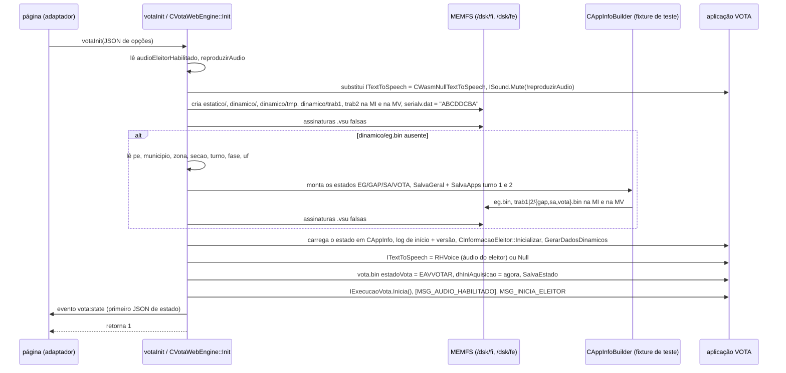

# u29: a plataforma web, parte 2 — `votaInit`, o JSON de estado e as funções que as ferramentas arquivaram junto com o ponto de entrada web

A unidade u29 tem 110 funções wasm (52,212 bytes de código). As ferramentas deram a todas elas o título "web platform:
`uenux2/wasm/vota_web` + `uenux2/mock/app/simulador`" e o grupo "free functions", porque elas foram
atribuídas pelos seus chamadores: a maioria é chamada por `votaInit` (func 7840), pelos mocks web
(`simulador::CWasm*`) ou pela fixture de teste web (`comum::teste::CAppInfoBuilder`). Lendo-as, vê-se
que **só cerca de um terço é código da plataforma web**. O restante é código de biblioteca (SQLite, `<format>` da libc++) e
classes da aplicação que o código web por acaso chama. As unidades u28, u30 e u31 contêm o restante da plataforma
web (`main`, `votaTick`, `votaPressKey`, as classes `CWasm*`).

| grupo | funções | bytes | o que são |
|---|---:|---:|---|
| ponto de entrada web `vota_web_wasm.cpp` | 12 | 15,027 | `votaInit` (`CVotaWebEngine::Init`), o montador do JSON de estado, o escapador de JSON, o singleton do engine (+ suas instanciações de `unique_ptr` e o destrutor estático), emissão de eventos, dois repassadores para imports do TSE |
| mocks web `mock/app/simulador/wasm` | 12 | 10,683 | resolvedor de caminhos de recursos e leitor de arquivos, conversão de Latin-1 para UTF-8 para o canvas, escala de caminhos, o barramento de log em memória, os dois callbacks exportados de espera de áudio, destrutores estáticos, construtor de `CSimuladorWasm` |
| fixture de teste web `mock/app/comum/cappinfobuilder.cpp` | 5 | 1,214 | `Converte(EMidia)`, o wrapper mesclado "salvar os dois turnos", o destrutor do builder, dois auxiliares de cópia |
| classes da aplicação (`comum`, `vota`, `api`, `ecourna`) | 27 | 2,533 | serviços de estado (`CServicoEstadoGeral*`) e registros de estado (`CEstadoGeral`, `CDadoCorrespondencia`, …) usados pela fixture; `CCandidaturas::GetInst`; `CPath`; auxiliares da pilha de `IForm<IScreen>`; partes iniciais de `CPolySingletonList::push<>`; `CStringUtils::ToUpper` |
| **SQLite** (atribuído incorretamente) | 28 | 18,344 | módulo R*Tree (insert/split, heap do cursor, cache de nós), funções de data, comparação de rótulos JSON, edição de `ALTER TABLE RENAME`, funções de janela |
| **libc++** (atribuída incorretamente) | 25 | 3,954 | internos Unicode de `<format>` (grapheme clusters, saída com escape), auxiliares de `std::filesystem`, instanciações de contêineres |
| **RHVoice** (atribuído incorretamente) | 1 | 457 | `speech_processor::insert` |

43 das 110 executaram durante as votações gravadas (`analysis/runtime/*.functions.tsv`), entre elas `votaInit`, o
montador e o escapador do JSON de estado, o resolvedor de recursos, o barramento de log, os serviços de estado (construtores 3787/5812/3897,
`Salva` 2894/3592/5329) e os auxiliares de cópia da fixture 5324/9862. Os construtores do modelo md que esses auxiliares chamam
(5629, 5109 e 5630/5632) não estão nas amostras: o profiler por amostragem de 20 µs perde funções tão pequenas, então uma
célula "run" vazia não significa "nunca executada".

Fontes reconstruídas (o sufixo `.u29` marca um fragmento de um arquivo compartilhado com outras unidades):

```
src/uenux2/wasm/vota_web/vota_web_wasm.u29.cpp                  CVotaWebEngine, votaInit, BuildStateJson, EscapeJson, ... (7840 5500 9640 5408 5521 3533 2094 9646 9649)
src/uenux2/mock/app/simulador/wasm/cwasmresource.u29.cpp        ResolveCaminho 2626, NomeGifMulher4 4996, LeArquivo 3452      (path inferred)
src/uenux2/mock/app/simulador/wasm/cwasmscreen.u29.cpp          EscalaCaminho 5113, Latin1ParaUtf8 5098                         (path inferred)
src/uenux2/mock/app/simulador/wasm/cwasmlogbus.u29.cpp          CWasmLogBus::Publica 5152                                        (path inferred)
src/uenux2/mock/app/simulador/wasm/cwasminit.u29.cpp            LogComando 1524                                                  (path inferred)
src/uenux2/mock/app/simulador/wasm/cwasmwebsound.u29.cpp        uenux_wasm_web_sound_wait_finished 9604 / _cancel_requested 9614 (path inferred)
src/uenux2/mock/app/simulador/wasm/cwasmthread.u29.cpp          s_threads (static dtor 9662)
src/uenux2/mock/app/comum/cappinfobuilder.u29.cpp               Converte(EMidia) 5344, merged SalvaApps wrappers 6004, ~CAppInfoBuilder 5644,
                                                                copy helpers 5324/9862
src/uenux2/src/app/comum/appinfo/servicos/iservicoestado.u29.h  IServicoEstado::Salva 2894, per-turno ctor 3897, 1941 3787 5812 3592 5329 (path inferred)
src/uenux2/src/app/comum/dados/md/estadoaplicacao/*.u29.cpp     ~CEstadoGeral 2793, CDadoCorrespondencia 5630, CDadoLocal 5632,
                                                                CNumViasImpressasRelatorios 5629, CEstadoGeralVota::MarcaInicioAquisicao 5627
src/uenux2/src/app/comum/dados/ccandidaturas.u29.cpp            CCandidaturas::GetInst 521
src/ecourna/app/dados/midias/cidentificadorgeradormidia.u29.cpp CIdentificadorGeradorMidia 5109                             (path inferred)
src/ecourna/api/util/cstringutils.u29.cpp                       CStringUtils::ToUpper(const std::string&) 5156
```

As funções já reconstruídas por outras unidades são apenas mapeadas (§13): `CPath` (762, 1082, 5899, 6047 → u22),
`CInformacaoEleitor::DesabilitaAudio` (4195 → u07), `IForm<IScreen>` (5056, 5069, 8902 → u17),
`CSimuladorWasm` (8311 → u19). Funções de biblioteca não recebem arquivo-fonte; a tabela dá o símbolo da biblioteca.

---

## 1. Finalidade e os termos em português

A página do simulador (`upstream/site/vota-wasm.html`) executa a aplicação de votação da urna compilada para
WebAssembly. O JavaScript conversa com ela por cinco funções C exportadas (`docs/03-js-wasm-interface.md`).
Esta unidade contém a mais importante delas, **`votaInit`**, que transforma um sistema de arquivos vazio em memória
mais um cenário de eleição numa urna **pronta para um eleitor**, e **o JSON de estado**, que diz à página o que
o eleitor está fazendo para que ela possa mostrar o seu guia.

Termos usados abaixo:

* **urna / UE**: a urna eletrônica. **eleitor**: quem vota. **mesário**: quem normalmente abre a
  votação, identifica cada eleitor e libera a urna (mensagem `MSG_INICIA_ELEITOR`).
* **cargo**: o cargo em votação (Vereador, Prefeito, Deputado…). **proporcional** (por lista partidária) vs
  **majoritário** (mais votos). **legenda**: voto só no partido (2 dígitos num cargo proporcional).
  **branco**: voto em branco. **nulo**: voto nulo. **candidato inapto**: candidato cujos votos são anulados.
* **pleito / PE (processo eleitoral)**: o evento eleitoral (2400 municipal, 2500 geral nos cenários).
  **turno**: 1 ou 2. **fase**: `oficial` (1), `simulado` (2) ou `treinamento` (3).
* **UF**: estado; **município**, **zona** (zona eleitoral), **seção** (seção eleitoral).
* **MI / MV** (também FI / FE): *mídia interna* (flash interna, `/dsk/fi`) e *mídia de votação* (o
  cartão removível, `/dsk/fe`); `comum::EFlashOrigem` 0 / 1. **estático / dinâmico**: dados da eleição somente leitura / área de trabalho.
* **eg.bin, vota.bin, gap.bin, sa.bin**: os arquivos de estado persistente (*estado geral* da urna, da aplicação
  VOTA, do GAP e do SA). **.vsu**: seus arquivos de assinatura. **carga**: a preparação das mídias da urna,
  registrada como *correspondência*.
* **aquisição (de votos)**: a coleta dos votos; `dhIniAquisicao` é quando ela começou.
* **RHVoice**: o sintetizador de voz usado na orientação sonora do eleitor (acessibilidade, *áudio do eleitor*).

---

## 2. Classes e como se relacionam

Só existe RTTI para classes polimórficas; as classes do ponto de entrada web ficam num namespace anônimo.

```
(anonymous namespace)::CVotaWebEngine            40 bytes, not polymorphic; singleton std::unique_ptr @1832600
(anonymous namespace)::CPoliticaExecucaoEleitorWeb, CWasmSavd, CSincronismoVotoEleitorWeb   (units u28/u30)

simulador::CWasmResource : api::IResource        vtable @1530184  -> helpers 2626 / 4996 / 3452 (this unit)
simulador::CWasmScreen   : api::IScreen          vtable @1528824  -> helpers 5113 / 5098 (this unit)
simulador::CWasmInit     : comum::IInterfaceInit vtable @1528772  -> logger 1524 (this unit)
simulador::CWasmLogd     : api::CEscritorLog     vtable @1530808  -> log bus channel 2
simulador::CWasmWebSound : api::ISound           (u31) + simulador::(anon)::CEsperaAudioWasm : api::IEsperaAudio
simulador::CWasmLogBus                           no RTTI, static object @1832676, see §6.3 (name inferred)

comum::IServicoEstado<ESTADO, CONVERSOR>         (path inferred iservicoestado.h; one instantiation per file)
 ├ comum::CServicoEstadoGeral        eg.bin    vtable @1558024   (8 bytes)
 ├ comum::CServicoEstadoGeralVota    vota.bin  vtable @1558064   (12 bytes: + turno)
 ├ comum::CServicoEstadoGeralGap     gap.bin   vtable @1558120   (12 bytes)
 └ comum::CServicoEstadoGeralSA      sa.bin    vtable @1558176   (12 bytes)
   (RTTI: each service is "si" with its IServicoEstado<…> instantiation as DIRECT base; there is no
    intermediate per-turno class. The three per-turno constructors share one merged body, func 3897.)

comum::teste::CAppInfoBuilder (500 bytes, test fixture, u28 header) holds by value:
   CEstadoGeral m_geral (+0, 180 B) · CEstadoGeralGap m_gap[2] (+180, 44 B) · CEstadoGeralSA m_sa[2] (+268)
   · CEstadoGeralVota m_vota[2] (+300, 100 B)
CEstadoGeral ⊃ CDadoLocal (+8) ⊃ CLocalidadeEleitoral (+20) · CDadoCarga (+32) · CAjusteDataHora (+52)
             · CDadoCorrespondencia (+60, 96 B) ⊃ ecourna::app::dados::CIdentificadorGeradorMidia (+60 of it)
```

### 2.1 `CVotaWebEngine` (40 bytes)

| offset | membro (nome inferido) | significado | escrito por |
|---:|---|---|---|
| +0 | `bool m_initialized` | `votaInit` teve sucesso | `Init` (um store de 16 bits do valor 1 também limpa +1) |
| +1 | `bool m_done` | o eleitor terminou | `votaTick` |
| +2 | `bool m_audioEnabled = true` | opção `reproduzirAudio`; `ISound` fica mudo quando false | `Init`, `SetAudioEnabled` |
| +3 | `bool m_audioEleitorHabilitado` | opção `audioEleitorHabilitado` (áudio do eleitor com RHVoice) | `Init` |
| +4 / +5 | `bool m_recordingStarted / m_recordingFinished` | animação "Gravando…" exclusiva da web | `votaTick` |
| +8 | `int m_recordingStep` | passo da barra de progresso 0…4 | `votaTick` |
| +16 | `double m_recordingDeadline` | prazo em `performance.now()` | `votaTick` |
| +24 | `std::string m_lastJson = "{}"` | último JSON enviado à página | `Init`, `votaTick`, `votaGetStateJson` |

`GetInst` (func 2094) o cria de forma preguiçosa com `std::make_unique` (a inicialização por valor aparece como um
`memset(0, 40)` seguido dos dois inicializadores padrão de membro). As funcs 4954/5101 são as instanciações de
`unique_ptr::reset`/`~unique_ptr`, e a 9832 é o destrutor `atexit` da variável estática.
Os dois nomes de método atestados (`Init`, `SetAudioEnabled`) estão em inglês, então os nomes inferidos neste arquivo
seguem esse estilo.

---

## 3. `votaInit` passo a passo (func 7840, `CVotaWebEngine::Init`, srcloc `vota_web_wasm.cpp:515`)

`votaInit(const char* json)` é `CVotaWebEngine::GetInst().Init(json)` com `Init` inlinado. A página o chama
uma vez, depois de montar o cenário, com (municipal-t1):

```json
{"fase":"te","pe":2400,"turno":1,"uf":"ac","municipio":1,"zona":1,"secao":1,"audioEleitorHabilitado":false,"reproduzirAudio":false}
```

Todos os passos ficam dentro de um único `try`: uma `std::exception` é reportada com `ReportError(e.what())` (func 10857:
`console.error` + evento `vota:error`) e `votaInit` retorna 0; qualquer outra coisa reporta
`"erro desconhecido em votaInit"`.



1. **Opções de áudio.** `audioEleitorHabilitado` (padrão false) → +3; `reproduzirAudio` (padrão true) → +2.
   Os leitores são buscas de string escritas à mão (u30), não um parser de JSON.
2. **Engines de fala.** `replace<ITextToSpeech>(make_unique<CWasmNullTextToSpeech>())`, através do
   wrapper registrar-ou-substituir da u19 §3.4 (auxiliar por valor 4162 → `replace<ITextToSpeech>` 7667: `exists` →
   `erase` → `push` inlinado). Ele substitui o engine nulo que `main` registrou através da func 8302
   (`simulador::CSimuladorWasm::Executa`); um `push` simples lançaria 6756
   `"{}: instância já criada de {}"` por causa da duplicata. Depois,
   `CPolySingleton<ISound>::instance(info, source_location::current()).Mute(!reproduzirAudio)` — a chamada
   cujo argumento padrão produziu o único srcloc de `Init` (linha 515).
3. **Árvore de armazenamento**, para MI (0) e MV (1): `create_directories` de `CPath::GetPathEstatico`,
   `GetPathDinamico`, `GetPathDinamico / "tmp"`, `GetPathTrab(flash, '1')`, `GetPathTrab(flash, '2')`, depois
   `WriteFileIfMissing(GetPathRootSemSA(flash) / "serialv.dat", "ABCDDCBA")` (func 11818). O pacote do
   cenário já traz `/dsk/fi/serialv.dat` com o mesmo texto; na MV, o symlink do adaptador o fornece.
   Depois, `WriteSimulatedSignatures()` (func 11733, u30): `uenux.vsu`, `vota.vsu`, `rdv.vsu`, `eg.vsu`,
   `gap.vsu`, `sa.vsu` contendo `assinatura simulada para vota_web_wasm`.
4. **Estado persistente fabricado**, só se `/dsk/fi/dinamico/eg.bin` não existir:
   * lê `pe`, `municipio`, `zona`, `secao`, `turno` (inteiros, padrão 1), `fase` (padrão `"te"`) e
     `uf` (padrão `"ee"`);
   * `fase`: `"oficial"`/`"o"` → `'1'`, `"simulado"`/`"s"` → `'2'`, qualquer outra coisa → `'3'` (treinamento);
   * `CAppInfoBuilder builder(pe)` (func 10268, u30: versão `"7.2.1.3 - TESTE EG ASN1"`; a
     correspondência da func 10261 é uma carga de teste constante: número interno 87654321, série da FC
     `"12345678"`, carga 31/12/2020 23:59:58, código `"123456789012345678901234"`, seção 1/1/1, gerador
     `{"nome_maquina", "12345678", "99999999"}` da func 9952), depois `.SetFase(fase)` (EG +48) `.SetTurno(turno == 2 ? '2' : '1')` (EG +32)
     `.SetTipoUrna('1')` (EG +36/+40, tipo de urna T1/T2) `.SetLocal(municipio, zona, secao)` (EG +20/+24/+26);
   * `uf = CStringUtils::ToUpper(uf)` (func 5156) em EG +8 (`CDadoLocal::m_uf`);
   * para os dois turnos: `vota.estadoVota = '1'` (EAVINICIAL) e `vota.treinamentoEleitor = true` (+72) —
     toda sessão do simulador é de *treinamento do eleitor*, qualquer que seja a `fase`;
   * `builder.Salva(false, {MI, MV})` (func 10256): `SalvaGeral` (eg.bin) e `SalvaApps` para os turnos 1 e 2
     (o wrapper mesclado 6004) → `trab1|2/{gap,sa,vota}.bin` nas duas flashes (a u28 documenta os arquivos);
   * as assinaturas falsas de novo, e `~CAppInfoBuilder` (func 5644).
5. **Carregar e iniciar o VOTA.** `CarregaAppInfo(CAppInfo::GetInst())` (func 11572 do mock, u30) lê os arquivos
   de volta para `comum::CAppInfo`; `CLogVota` registra `"Iniciando aplicação - {}"` com o turno (func 11641)
   e `"Versão da aplicação: {}"` (func 11642); `vota::CInformacaoEleitor::Inicializar()` (func 7787, u02:
   carrega os dados da eleição e monta `CTelasVota`, `CCargos`, `CCandidaturas`, …) e
   `GerarDadosDinamicos()` (func 6737); assinaturas falsas de novo.
6. **Áudio do eleitor.** Se `audioEleitorHabilitado`: `/etc/RHVoice` e `/share/RHVoice` precisam existir (a página
   só monta `rhvoice-leticia.data` quando a opção de acessibilidade está ligada); caso contrário,
   `std::runtime_error("dados do RHVoice nao foram carregados para habilitar o audio do eleitor")`;
   depois, `replace<ITextToSpeech>(make_unique<api::CRHVoiceTextToSpeech>(path("/")))` (o mesmo wrapper,
   4162 → 7667). Caso contrário, um `CWasmNullTextToSpeech` novo substitui o engine atual da mesma forma.
7. **Abrir a votação.** `CAppInfo::GetVota(Atual).SetEstadoVota(EAVVOTAR)` (func 11266; o enum C++ é o
   valor ASN.1 + `'1'`, então `votar (7)` é 56 = `'8'`), `MarcaInicioAquisicao()` (func 5627: `dhIniAquisicao
   = now` se ainda não definido), `comum::SalvaEstado()` (func 491: grava e "assina" `vota.bin` na MI e na MV), assinaturas
   falsas de novo. Na urna, este estado só é alcançado depois do relatório da *zerésima* e do
   registro dos mesários.
8. **Liberar a urna para um eleitor.** `IExecucaoVota::GetInst()` é a política web
   `CExecucaoVotaCooperativa` (registrada por `main`): o slot 3 `Inicia()` instala o primeiro estado do eleitor
   (`CAguardaMensagem`). Depois, na fila do eleitor (`GetFilaEleitor()`, slot 8):
   `MSG_AUDIO_HABILITADO` (9) se o áudio do eleitor estiver ligado, senão `CInformacaoEleitor::DesabilitaAudio()` (func 4195);
   e sempre `MSG_INICIA_ELEITOR` (1). **Na urna, esta mensagem é enviada pelo terminal do mesário depois de
   identificar o eleitor** (`CNomeEleitor`, `CDigitalReconhecida`, `CControlaReconhecimento`). O build web
   não tem identificação do eleitor, nem biometria, nem mesário.
9. `m_initialized = true; m_done = false; m_lastJson = BuildStateJson(); EmitEvent("vota:state", m_lastJson)`,
   retorna 1. O primeiro estado ainda é `vota::CAguardaMensagem`; o primeiro `votaTick` processa a mensagem 1.

**`votaInit` funciona uma vez por instância do módulo** (verificado, §11): uma segunda chamada chega ao passo 5 e falha com
`CTelasVota - instancia ja criada` (`CTelasVota::CreateInst`), porque `CInformacaoEleitor::Inicializar`
não é reentrante; a fixture do passo 4 é pulada porque `eg.bin` existe. Por isso a página recarrega entre
eleitores ("Refazer votação" → `location.reload()`).

---

## 4. O JSON de estado (func 5500, `BuildStateJson`)

Chamada por `votaInit`, `votaTick` (depois de cada passo; o evento só é enviado quando o nome do estado ou o texto
mudou) e `votaGetStateJson`. O formato e a lista de campos estão em `docs/03-js-wasm-interface.md` §13; aqui está como
cada campo é calculado.

* `state` = `CurrentStateName()` (func 5408): o estado atual da thread do eleitor (slot 9 de `IExecucaoVota`) →
  `typeid(*estado).name()` → `DemangleTypeName` (func 5521, `abi::__cxa_demangle`; em caso de falha, recorre ao nome
  mangled). `""` se não houver estado.
* `substate`: só se o estado for `vota::CEleitorVotando` — o teste é uma comparação com a sua vtable
  (@1533152): `CEleitorVotando` é `final`, e o clang transformou o `dynamic_cast` numa comparação de vptr. O seu
  subestado por cargo (+12, `m_estadoCargo`) passa pelo demangle da mesma forma.
* `screen` = `"accessibility"` quando `substate` contém `CInstrucaoVotacaoAcessibilidade`.
* `proporcional` = o cargo atual tem um detalhe de candidato (flag de `optional` +84) **e** `tipo == 1`. Protegido por
  `CCargos::IsEnd()`; qualquer exceção é engolida.
* `guide.legendaValida` = proporcional **e** pelo menos dois dígitos digitados **e** `LegendaValida(cargo,
  ToWord(g_votoDigitado.substr(0, 2)))` (func 5922, nome inferido: o partido existe em `CPartidos` e tem uma
  candidatura com campo +72 == 0 para este cargo).
  `vota::g_votoDigitado` (@1833288) é o próprio buffer de dígitos digitados do código de votação. Exceções → false.
* `guide.voteMode`, primeira regra que casar: não inicializado → `inicio`; terminado → `fim`; gravação iniciada
  (+4) ou `state` contém `CSincronismo` → `gravando`; tela de acessibilidade → `accessibility`; `substate`
  contém `Branco` → `branco`; `CPedeNominal` → `legendaOuNominal` se proporcional e legendaValida, senão
  `nulo`; `VotoLegenda` ou `CandidatoInexistente` → `legenda` / `nulo` pelo mesmo teste; `Nulo`,
  `Inexistente`, `Inapto` ou `Repetido` → `nulo`; caso contrário, `nominal`.
* `guide.confirmacao` = `substate` contém `VotoNominal` ou `MajoritarioValido` (false nas telas de confirmação de
  legenda, branco e nulo; o adaptador tem suas próprias verificações para essas).
* `cargo` (só quando não há `screen` e `!IsEnd()`): `id` = `GetCodigo()` (+0), `name` = `GetNome()` (func
  1547), `digits` = +12, `tipo` = `proporcional`/`majoritario` pelo mesmo teste, `,"legendaDigits":2` para
  cargos proporcionais (um texto constante).
* `candidates`: montado num segundo `ostringstream`. `GetNumerosCandidatos(cargo)` (func 2840, nome inferido) lista os
  números das candidaturas deste cargo **cujo campo +72 é 0**; cada um é buscado com a chave
  `cargo·1000000 + número` (`CCandidaturas::Chave`, func 1939) e impresso como
  `{"number":…,"name":…,"party":…,"apt":…}` (`number` +24, `name` +40, `party` u16 +22 do nó do map,
  `apt` = campo +72 == 0 — portanto é **sempre true**). A lista é `[]` na tela de acessibilidade. Uma
  exceção durante a listagem (buscas em CCandidaturas, escritas no stream) é capturada por um `catch (...)` interno que ainda
  fecha a lista com `]` (uma lista truncada, mas válida); uma exceção no bloco `cargo` vai para o handler
  externo, que acrescenta `,"candidates":[]` (veja §12 item 4).

Todos os valores string passam por `EscapeJson` (func 9640): `\" \\ \b \t \n \f \r`, os outros bytes abaixo de 0x20 como
`\u00XX` (4 dígitos), **bytes ≥ 0x80 como `\u00XX`**: o texto da aplicação é Latin-1 e o JSON é ASCII
puro, então `JSON.parse` produz os caracteres certos (`"Gin\u00e1stica"` → "Ginástica").

---

## 5. Outras funções de `vota_web_wasm.cpp` nesta unidade

| func | nome (inferido) | o quê |
|---:|---|---|
| 3533 | `EmitEvent(nome, json)` | o único chamador do import `js_emit_event`; usado para `vota:ready`, `vota:state`, `vota:done`, `vota:error`, `vota:screen` |
| 9646 | `ConsoleError(texto)` | `js_console_error(texto.c_str())` para `ReportError`: imprime o texto Latin-1 **bruto** (U+FFFD no console, 03 §7.4) |
| 9649 | `PushKey(tecla)` | `js_push_key(tecla.c_str())` para `votaPressKey`: a tecla volta para a fila `Module.uenuxKeys` do JavaScript |
| 2737 / 3355 | — | instanciações fora de linha de `std::string::find(const char*)` / `find(const std::string&)`, usadas por `BuildStateJson`/`votaTick` e pelos leitores de JSON |
| 9507 / 9437 | — | partes iniciais de `CPolySingletonList::push<IPoliticaExecucaoEleitor>` / `push<ISincronismoVotoEleitor>` chamadas por `main` (u19 §3.4) |
| 5120 | — | `std::function<void()>::~function` para a lambda de `main` |

---

## 6. Os auxiliares dos mocks web

### 6.1 Recursos: `ResolveCaminho` (2626), `NomeGifMulher4` (4996), `LeArquivo` (3452)

`simulador::CWasmResource` (u31) implementa `api::IResource` a partir do MEMFS. Toda busca primeiro resolve o nome
de recurso da aplicação:

1. remove todos os `:` iniciais (sintaxe de recurso do Qt `:/resource/...`) e acrescenta `/` no início se faltar;
2. candidatos: o próprio caminho; para `/resource/images/X`: `/uenux/app/img/X`, `/pkg/img/X`; para
   `/resource/gifs/X`: `/pkg/gifs/X`, o caminho com `Mulher4` inserido antes do último `.gif`, e
   `/pkg/gifs/` + X com `Mulher4`; duplicatas removidas (`std::unique`);
3. o primeiro candidato que um `std::ifstream` consegue abrir vence → `js_resource_log("resolve", nome, caminho,
   -1)`; nenhum → `js_resource_log("missing", nome, "", -1)` e `""`.

O pacote traz apenas `/uenux/app/img/**` e `/resource/gifs/*Mulher4.gif`; `/pkg/…` não existe (resquício
de outro layout). Toda animação de instrução é, portanto, substituída pelo seu avatar **"Mulher4"**. No
máximo 4 candidatos são testados (imagens 3, GIFs 4); na prática, uma imagem é resolvida no 2º
(`/uenux/app/img/`) e um GIF no 3º (o caminho com `Mulher4`). `LeArquivo` então abre o arquivo escolhido mais uma
vez e o lê num `std::vector<unsigned char>` via `istreambuf_iterator` (byte a byte; os GIFs têm de
0.83 MB (`vereadorMulher4.gif`) a 1.58 MB (`votoNuloMulher4.gif`)).

### 6.2 Tela: `EscalaCaminho` (5113), `Latin1ParaUtf8` (5098)

`EscalaCaminho` multiplica um caminho (`api::SPathElement`: MoveTo / LineTo / ArcTo(rect, start°, sweep°) /
Close, 56 bytes) por `sx`/`sy` (CWasmScreen +16/+24) antes de `js_path`; tipos de elemento desconhecidos são descartados.
`Latin1ParaUtf8` converte todo texto para `js_text`/`js_measure_text_width` (bytes ≥ 0x80 → UTF-8 de 2 bytes).

### 6.3 O barramento de log (5152) e o logger de `CWasmInit` (1524)

Um objeto estático em 1832676 (168 bytes; byte de guarda 1832844; destruído pela func 5154): um mutex (no-op) e
três canais de `{deque<string> historico; unordered_map<int, function<void(const string&)>> ouvintes;
int proximoId = 1}`. `Publica(canal, texto)` carimba `"[%Y-%m-%d %H:%M:%S] "` (hora local), acrescenta, mantém no
máximo **2000 linhas** e chama os ouvintes do canal fora do lock. O canal 0 recebe
`"CWasmInit::{comando} {resposta}"` de `CWasmInit::EnviarMensagem` (via 1524), e o canal 2, toda linha do
log da aplicação depois que `CWasmLogd` a grava em `logd.dat`. **Nenhuma função do binário registra um
ouvinte** (os maps só são lidos e destruídos), então neste build o barramento é um histórico limitado em memória
que ninguém lê — o lado de inscrição (provavelmente para um painel de depuração) não foi linkado.

### 6.4 Esperas de áudio: os exports `uenux_wasm_web_sound_wait_cancel_requested` (9614) e `_finished` (9604)

A espera de `CWasmWebSound` (slot 9, u31) armazena `{std::function<bool()> cancelado, std::function<void(bool)>
fim}` sob um id novo em `std::map<int, …>` @1832664 e chama `js_wasm_web_sound_wait_async(id)`. O glue
faz polling a cada 20 ms: `cancel_requested(id)` retorna `cancelado()` (0 para um id desconhecido); `finished(id, ok)`
move `fim` para fora, apaga a entrada e então chama `fim(ok != 0)`. Os dois callbacks registrados pelo código de
votação são `vota::CVotacaoStateAudio::IniciarEsperaFimAudio()::$_0` / `$_1` (RTTI dos alvos dos `std::function`).
A func 9631 é o destrutor estático do map.

### 6.5 Threads

A func 9662 libera o `std::vector` estático @1832648 no qual `CWasmThread::Create` registra cada "thread"
(`{rotina, argumento, 0, id}`): sem pthreads nada executa em paralelo; a thread do eleitor é avançada passo a passo por
`votaTick`.

---

## 7. O suporte à fixture em `comum` (arquivos de estado)

O build web grava o estado persistente da urna com as mesmas classes da urna (u20, u05):

| arquivo | tipo ASN.1 | serviço (vtable) | classe md | entrada de Salva |
|---|---|---|---|---|
| `<flash>/dinamico/eg.bin` | `ModuloEstadoGeralUrna.EstadoGeralUrna` | `CServicoEstadoGeral` (@1558024) | `CEstadoGeral` 180 B | 3592 → 2894 |
| `<flash>/dinamico/trab<t>/vota.bin` | `ModuloEstadoGeralVota.EstadoGeralVota` | `CServicoEstadoGeralVota` (@1558064) | `CEstadoGeralVota` 100 B | 5329 → 2894 |
| `<flash>/dinamico/trab<t>/gap.bin` | `ModuloEstadoGeralGap.EstadoGeralGap` | `CServicoEstadoGeralGap` (@1558120) | `CEstadoGeralGap` 44 B | 10112 → 2894 |
| `<flash>/dinamico/trab<t>/sa.bin` | `ModuloEstadoGeralSA.EstadoGeralSA` | `CServicoEstadoGeralSA` (@1558176) | `CEstadoGeralSA` 16 B | 10089 → 2894 |

* `Salva` (corpo mesclado 2894): `GetPathArquivo()` (slot 2 da vtable), um objeto conversor sem estado na pilha
  (`CConversorEstadoGeral*`), `Converte(estado)` para a entidade ASN.1, `CFileASN::WriteToFile(path, entity)`
  (BER, modo de arquivo `"wb"`, func 2892).
* Os construtores de serviço por turno (corpo mesclado 3897: 3787 vota, 5812 gap, 11566 sa) armazenam `{vptr, flash,
  turno}`; **o turno `'3'` (atual)** é resolvido na construção lendo o `eg.bin` **da mesma flash**
  (`CServicoEstadoGeral(flash).Carrega()`, +32). São três construtores separados (um por
  `cservicoestadogeral{vota,gap,sa}.cpp`) que o wasm-opt mesclou porque só a constante da vtable difere; a RTTI
  descarta uma classe base comum por turno. `GetPathArquivo()` não é `const` (assinatura do srcloc na linha 32 de
  cada arquivo), então `Salva`, que a chama pelo slot 2, também não pode ser um membro `const`.
* Construtores de modelo usados quando o builder copia seus estados antes de salvar: `CDadoCorrespondencia`
  (5630, 96 B: número interno da urna, número de série da FC, data/hora da carga, código da carga, seção
  da carga, assinatura, identificador do gerador de mídia), `CDadoLocal` (5632: UF, município/zona/seção,
  tipo de local), `CNumViasImpressasRelatorios` (5629: cópias impressas de quatro relatórios),
  `CIdentificadorGeradorMidia` (5109: nome, serial do certificado TPM, serial de instalação). Os auxiliares de
  cópia folha 5324 e 9862 da fixture reconstroem os dois últimos através desses construtores.
* `CEstadoGeralVota::MarcaInicioAquisicao` (5627) também é chamada pelo próprio `CInicioVotacao` da urna.

---

## 8. Código de biblioteca que as ferramentas arquivaram aqui

Os chamadores destas funções fizeram o classificador colocá-las em `app:wasm-entry`/`app:simulador`. Elas não
são código do TSE.

* **SQLite 3.50.4** (a urna mantém `uenux.db` para o comparecimento dos mesários e as justificativas, u24):
  R*Tree — `rtreeInsertCell` (2973, com `SplitNode` inlinado), `AdjustTree` 6289, `fixBoundingBox` 6287,
  `updateMapping` 6288, `nodeInsertCell` 6290, `nodeWrite` 4002, `nodeRelease` 583, `rowidWrite`/`parentWrite`
  3999/4000, `SortByDimension` 4001, `nodeGetRowid` 6303, heap do cursor `rtreeSearchPointPop/New` 4004/4005,
  `rtreeEnqueue` 6293, `rtreeStepToLeaf` 6297, `resetCursor` 6299; datas — `computeJD` 1090,
  `computeYMD_HMS` 1299, `getDigits` 1424, `parseHhMmSs` 4016; JSON — `jsonLabelCompareEscaped` 4011;
  `ALTER TABLE … RENAME` — `renameEditSql` 4019, `renameWalkTrigger` 4020; `valueFromValueList` 6547;
  funções de janela — corpos mesclados 6073 (finalize de `first_value`/`nth_value`) e 6074 (value de `row_number` /
  finalize de `count`), corpos ICF 6325 (inverse de `percent_rank`/`cume_dist`) e 6326 (o step deles). Nenhuma delas
  executa numa votação (o código de R*Tree, JSON e funções de janela entra na compilação pelos padrões da receita do Conan,
  docs/libraries/sqlite.md).
* **libc++ `<format>`**: auxiliares Unicode usados para calcular a largura de exibição de strings formatadas —
  `__code_point_view::__consume` 2905, `__is_continuation` 3878, regras de grapheme cluster
  `__evaluate_none` 2874, buscas de propriedade 3866/3868 (corpo mesclado 6072), saída com escape
  `__write_escaped_code_unit` 5927 (+ 5926, 5933), `basic_format_context::locale()` 2292.
* **libc++, outros**: `std::filesystem::operator/` 5968, `path::parent_path` 3706, instanciações de vector/unique_ptr/deque/
  exception-guard (520, 1698, 2662, 2670, 2720, 3501, 4954, 5101, 5120, 5150, 5294, 5532,
  6005).
* **RHVoice**: `speech_processor::insert` 2209 (compartilha o corpo ICF 2662 com `CWasmScreen`).

---

## 9. Boletim de urna (BU)

Esta unidade não gera, não assina nem imprime um BU, e o fluxo web nunca chega ao *encerramento*: a página
atende um eleitor e recarrega. Ela importa para o BU de uma forma: **`votaInit` fabrica os dados de identidade
que um BU carregaria**. O `eg.bin` recebe as opções `pe` (idPE), `uf`, `municipio`, `zona`, `secao`,
`turno`, `fase` e as constantes da fixture (versão `"7.2.1.3 - TESTE EG ASN1"`, tipo de urna `'1'`, uma
carga de teste constante: urna 87654321, carga datada de 31/12/2020 23:59:58, código `"123456789012345678901234"`,
gerador `"nome_maquina"`; funcs 10261/9952, u30), e o `vota.bin` recebe `treinamentoEleitor = true`, `estadoVota = EAVVOTAR` e `dhIniAquisicao`. O
código do BU (`CGeraBU`, u08) lê exatamente esses campos (município/zona/seção, turno, fase, histórico de cargas do
`gap.bin`) quando monta a `EntidadeBoletimUrna`. As assinaturas `.vsu` ao lado deles são o texto literal
`assinatura simulada para vota_web_wasm`, e `CWasmSavd` (u28) aceita toda requisição de assinatura e
validação.

---

## 10. Observações sobre o build web e o wasm

* **O build web pula o mesário.** `votaInit` define os estados que a zerésima, o registro dos mesários
  e a identificação do eleitor produziriam, e depois envia ele mesmo `MSG_INICIA_ELEITOR`.
* **Nomes de classe são uma interface.** O guia da página depende de substrings dos nomes de classes C++ após o demangle
  (`CPedeNominal`, `VotoLegenda`, `CSincronismo`, …). Renomear uma classe de estado muda o que a página diz ao
  eleitor, sem nenhum erro de compilação.
* **merge-similar-functions** produziu vários corpos com constantes como parâmetros: 3897 (construtores; a
  vtable é um parâmetro), 2894 (Salva: dois slots de tabela e uma vtable), 6004 (turno), 6005 (um slot `__vallocate`),
  6072 (formato de tabela Unicode), 6073/6074 (tamanhos de agregados do SQLite). Os thunks deles ficam em outras unidades.
* **`this` constante.** `CWasmLogBus::Publica` (5152) não tem parâmetro `this`: a única instância é uma variável estática,
  e o otimizador propagou o endereço dela (1832676) para dentro do corpo.
* **`dynamic_cast` para uma classe `final`** virou uma comparação de ponteiro de vtable em `BuildStateJson`.
* **Destrutores estáticos** registrados com `atexit`: 9832 (engine), 9631 (esperas de áudio), 9662 (threads),
  8592/8910 (pilha e observable de `IForm<IScreen>`). Eles só executam se o runtime sair, o que nunca acontece
  na página (`noExitRuntime`).
* **Exceções** só atravessam até os exports: todo `try` nesta unidade segue o padrão `invoke_*` +
  `__THREW__`; `votaInit` e `BuildStateJson` contêm, cada uma, 109 pontos de chamada `invoke_*` (cada um, quando
  executado, é uma ida e volta pelo JavaScript).

---

## 11. Verificado executando o simulador

Comandos executados a partir da raiz do projeto com `tools/run/headless.mjs` (cópias modificadas num diretório temporário, sem
alterar o repositório):

| experimento | resultado |
|---|---|
| `votaInit` duas vezes (segunda chamada `{"fase":"oficial","pe":9999,…}`), depois uma terceira chamada `{"audioEleitorHabilitado":true}` | as duas chamadas extras retornam 0 com `vota:error` `static void vota::CTelasVota::CreateInst():3435:1304 - CTelasVota - instancia ja criada`; as opções de cenário da segunda chamada (`fase`, `pe`, …) nunca são lidas (eg.bin existe), mas as opções de áudio são: `reproduzirAudio` está ausente, assume o padrão true, e o `vota:state` seguinte já reporta `"audioEnabled":true` (reverificado em 2026-09-23). Depois da terceira chamada, o `vota:state` seguinte reporta `"audioEnabled":true,"audioEleitorHabilitado":true`, embora nenhum engine RHVoice tenha sido instalado (as flags são escritas antes da falha) |
| primeiro `votaInit` com `audioEleitorHabilitado: true` e sem pacote de voz | retorna 0, `vota:error` `dados do RHVoice nao foram carregados para habilitar o audio do eleitor`; `votaTick` então retorna 0 e o estado é `{"state":"",…,"voteMode":"inicio"}` |
| primeiro `votaInit` com `"uf":"xyz"` | retorna 0: a camada ASN.1 o rejeita quando o `eg.bin` é codificado (`…DadoLocal.uf Campo AbstractString possui tamanho 3 maior que seu limite superior 2`) |
| primeiro `votaInit` com `"zona":70000` | retorna 0: `zona` é estreitada para 16 bits (70000 → 4464) sem nenhuma verificação, e a carga falha em `/dsk/fi/estatico/0000144640001-lo.dat` ("não existe") |
| primeiro `votaInit` com `"zona":65537` (reverificado em 2026-09-23) | retorna **1**: o valor vira silenciosamente a zona 1 e a sessão executa normalmente |
| primeiro `votaInit` com `"fase":"oficial"` (municipal-t1, 2026-09-23) | retorna 0: a fixture grava um `eg.bin` de fase oficial (`'1'`), e então a carga falha em `/dsk/fi/estatico/o02400-cp.dat` ("não existe"), porque os dados distribuídos são arquivos de treinamento (`t…`). `"fase":"of"` (o código que o `waitForScenarioData` do adaptador usa para um cenário oficial) não é reconhecido por `votaInit` e vira treinamento (`'3'`): retorna 1 |
| `--scenario geral-t1 --auto blank --full`, `--scenario municipal-t2 …` | todo valor `apt` nos eventos é `true` (159 + 10 ocorrências), como o código implica; ids de cargo 1, 3, 5, 6, 7 (geral) e 11 (municipal, 2º turno) |

```sh
node tools/run/headless.mjs --scenario geral-t1 --auto blank --full --events | grep -o '"apt":[a-z]*' | sort | uniq -c
```

---

## 12. Código suspeito ou digno de nota

1. **`votaInit` é de uso único e deixa um engine parcialmente atualizado em caso de falha** (func 7840). Uma segunda chamada falha
   em `CInformacaoEleitor::Inicializar` (`CTelasVota - instancia ja criada`), mas antes disso ela já
   reescreveu `m_audioEleitorHabilitado`/`m_audioEnabled`, substituiu o TTS por um nulo, emudeceu de novo o `ISound` e
   regravou os arquivos `.vsu`; `m_initialized` continua true, então `votaTick` segue em frente e o JSON reporta configurações
   de áudio que não estão em vigor. As opções de cenário (`pe`, `uf`, `municipio`…) são ignoradas silenciosamente
   sempre que o `eg.bin` já existe. Impacto: só no simulador (a página recarrega a cada eleitor). Baixa.
2. **O simulador pula o mesário e força o "treinamento do eleitor"** (7840). `MSG_INICIA_ELEITOR` é
   enviada pelo próprio `votaInit`; `treinamentoEleitor = true` é gravado para os dois turnos mesmo quando a opção
   `fase` é `"oficial"`. Verificado (§11): `"oficial"` produz de fato um `eg.bin` de fase oficial (com as assinaturas
   `.vsu` falsas), mas, com os dados de treinamento distribuídos, a inicialização então falha nos arquivos `o…` ausentes, e
   o `eg.bin` deixado para trás faz qualquer `votaInit` posterior na mesma página pular a fixture. Não alcançável a partir da
   página com os cenários distribuídos (todos enviam `"te"`), mas alcançável a partir de qualquer script que chame `votaInit`. Note também uma
   divergência entre os dois lados: o adaptador trata um cenário `"fase":"of"` como oficial quando espera pelos
   arquivos de dados (`o…-pu.dat`), enquanto `votaInit` só aceita `"oficial"`/`"o"` e transforma `"of"` em
   treinamento. Info.
3. **Orientação da página derivada de nomes de classes C++** (5500). `voteMode`, `confirmacao` e `screen` são
   testes de substring em nomes RTTI após o demangle; ex.: `confirmacao` é false nas telas de confirmação de
   legenda/branco/nulo, e qualquer classe renomeada ou adicionada (um subestado cujo nome contenha `Nulo`, `Branco`,
   `Inapto`…) muda o guia mostrado a um eleitor em treinamento. Risco de interface enganosa, só no simulador. Baixa.
4. **JSON inválido numa exceção tardia** (5500). O `catch (...)` externo em torno da parte `cargo`/`candidates`
   acrescenta `,"candidates":[]` depois do que já tiver sido escrito. Uma exceção depois que `,"cargo":{"id":…,"name":"`
   foi escrito, isto é, vinda de `CCargo::GetNome` (func 1547, que lança `"Não é cargo de consulta."` quando o cargo
   não tem nem detalhe de candidato nem de consulta) ou de uma falha de stream/alocação nesse bloco, produz portanto
   uma string/objeto não terminado. Exceções de `CCargos::GetCurrent` (antes de qualquer coisa ser escrita) e
   das buscas em `CCandidaturas` (`catch (...)` interno, lista fechada com `]`) deixam o JSON válido.
   `js_emit_event` então entrega `{raw, parseError}` à página. Não observado. Baixa.
5. **`apt` é constante** (5500 + 2840). A lista de candidatos mantém só as candidaturas cujo campo +72 é 0, e
   `apt` é calculado a partir do mesmo campo, então é sempre `true`; candidatos inaptos nunca são listados (o
   adaptador ignora `apt` de qualquer forma). Campo morto. Info.
6. **Barramento de log sem leitor** (5152). Toda linha de log da aplicação (canal 2) e todo comando init (canal 0) também
   são mantidos em memória (≤ 2000 linhas por canal, uma cópia de cada linha mais um `localtime_r` e um
   `ostringstream` por linha), mas nenhum ouvinte pode ser registrado neste build. Limitado; trabalho desperdiçado. Info.
7. **O resolvedor de recursos testa caminhos inexistentes** (2626). `/pkg/img/`, `/pkg/gifs/` nunca existem; cada busca
   testa até 4 candidatos com um `ifstream` (imagens 3, GIFs 4), e os leitores de imagem/GIF depois abrem o vencedor
   mais uma vez e o leem byte a byte (3452). Só desempenho; os nomes vêm da aplicação, não do
   usuário. Info.
8. **Estreitamento não verificado das opções** (7840). `zona` e `secao` são lidas como `int` e armazenadas como valores
   de 16 bits (`& 0xFFFF`, `SetLocal`, func 10176) sem verificação de intervalo: 70000 vira a zona 4464 (verificado), 65537
   vira a zona 1 e passa (verificado, `votaInit` retorna 1). `uf` só é convertida para maiúsculas; o seu comprimento é pego
   depois pelo codificador ASN.1. Todos os inteiros são lidos por `JsonInt` (func 11571, u30) com `strtol`: um valor sem
   dígitos recai em 1, mas não há verificação de intervalo nem de `errno`. Só no simulador. Baixa.
9. **A verificação do áudio do eleitor é superficial** (7840). Só os diretórios `/etc/RHVoice` e `/share/RHVoice` são
   testados (código); um pacote de voz montado parcialmente passa nesta verificação e só pode falhar depois, dentro de
   `CRHVoiceTextToSpeech` ou na primeira síntese (não testado). Baixa.
10. **Os callbacks de espera exportados confiam no id** (9604/9614). Qualquer script da página pode chamar
   `Module._uenux_wasm_web_sound_wait_finished(id, 1)` e concluir (ou cancelar) antes da hora uma espera de áudio pendente,
   avançando a máquina de estados de áudio. Inofensivo numa página de treinamento. Info.
11. **Segurança simulada** (contexto, 7840 → 11733, `CWasmSavd` da u28): os arquivos de estado são "assinados" com um
    texto fixo e toda requisição ao SAVD tem sucesso; o `rdv.dat` é criado na inicialização, mas nenhum voto é registrado nele
    (`CSincronismoVotoEleitorWeb`; depois de um voto só o `logd.dat` muda, analysis/runtime/README.md). Isso
    é intencional no simulador e não deve ser lido como o comportamento da urna. Info.

Nenhum caminho com `emscripten_sleep` foi encontrado nas funções desta unidade.

---

## 13. Tabela de mapeamento completa (110 funções)

`run` = observada executando nas votações gravadas. As linhas "biblioteca" não são reconstruídas (o motivo é indicado).
| # | func | tamanho | run | nome nas ferramentas | símbolo reconstruído | arquivo src (ou biblioteca + motivo) | arquivo original | conf. |
|---:|---:|---:|:---:|---|---|---|---|---|
| 1 | 520 | 35 | ✓ | `wasm_entry_f520` | `std::vector<T>::~vector (generic, via __destroy_vector 4967)` | biblioteca: instanciação de template compartilhada por ICF (15 chamadores com tipos de vector não relacionados) | libcxx <vector> | média |
| 2 | 521 | 84 | ✓ | `wasm_entry_f521` | `comum::CCandidaturas::GetInst` | src/uenux2/src/app/comum/dados/ccandidaturas.u29.cpp | uenux2/src/app/comum/dados/ccandidaturas.cpp | alta |
| 3 | 583 | 316 |  | `wasm_entry_f583` | `nodeRelease` | biblioteca: SQLite, veja docs/libraries/sqlite.md | sqlite3.c (amalgamação do SQLite 3.50.4) (rtree.c) | alta |
| 4 | 762 | 17 | ✓ | `wasm_entry_f762` | `comum::CPath::GetPathEstatico` | src/uenux2/src/app/comum/cpath.cpp (unidade u22) | uenux2/src/app/comum/cpath.cpp | alta |
| 5 | 1082 | 17 |  | `wasm_entry_f1082` | `comum::CPath::GetPathDinamico` | src/uenux2/src/app/comum/cpath.cpp (unidade u22) | uenux2/src/app/comum/cpath.cpp | alta |
| 6 | 1090 | 388 |  | `wasm_entry_f1090` | `computeJD` | biblioteca: SQLite, veja docs/libraries/sqlite.md | sqlite3.c (amalgamação do SQLite 3.50.4) (date.c) | alta |
| 7 | 1299 | 422 |  | `wasm_entry_f1299` | `computeYMD_HMS` | biblioteca: SQLite, veja docs/libraries/sqlite.md | sqlite3.c (amalgamação do SQLite 3.50.4) (date.c) | alta |
| 8 | 1424 | 275 |  | `wasm_entry_f1424` | `getDigits` | biblioteca: SQLite, veja docs/libraries/sqlite.md | sqlite3.c (amalgamação do SQLite 3.50.4) (date.c) | alta |
| 9 | 1524 | 705 | ✓ | `simulador_f1524` | `simulador::(anonymous namespace)::LogComando` | src/uenux2/mock/app/simulador/wasm/cwasminit.u29.cpp | uenux2/mock/app/simulador/wasm/cwasminit.cpp (caminho inferido) | média |
| 10 | 1698 | 35 | ✓ | `mock_f1698` | `std::vector<comum::md::estadoaplicacao::CDadoCorrespondencia>::~vector` | biblioteca: instanciação de template (elementos de 96 bytes; anotada em src/uenux2/src/app/comum/dados/md/estadoaplicacao/cestadogeral.u29.cpp) | libcxx <vector> | média |
| 11 | 1941 | 21 |  | `mock_f1941` | `comum::CServicoEstadoGeral::CServicoEstadoGeral` | src/uenux2/src/app/comum/appinfo/servicos/iservicoestado.u29.h | uenux2/src/app/comum/appinfo/servicos/cservicoestadogeral.h (caminho inferido) | alta |
| 12 | 2094 | 159 | ✓ | `wasm_entry_f2094` | `(anonymous namespace)::CVotaWebEngine::GetInst` | src/uenux2/wasm/vota_web/vota_web_wasm.u29.cpp | uenux2/wasm/vota_web/vota_web_wasm.cpp | média |
| 13 | 2209 | 457 |  | `simulador_f2209` | `RHVoice::speech_processor::insert` | biblioteca: RHVoice (o vector<double>::insert 2662, mesclado por ICF, é compartilhado com CWasmScreen) | RHVoice src/core/speech_processor.cpp | média |
| 14 | 2292 | 118 |  | `wasm_entry_f2292` | `std::basic_format_context<back_insert_iterator<__format::__output_buffer<char>>,char>::locale` | biblioteca: internos Unicode de <format> da libc++ | libcxx/include/__format/format_context.h | média |
| 15 | 2626 | 3824 | ✓ | `simulador_f2626` | `simulador::ResolveCaminho` | src/uenux2/mock/app/simulador/wasm/cwasmresource.u29.cpp | uenux2/mock/app/simulador/wasm/cwasmresource.cpp (caminho inferido) | média |
| 16 | 2662 | 821 | ✓ | `simulador_f2662` | `std::vector<double>::insert(const_iterator, const double*, const double*)` | biblioteca: insert de intervalo, corpo ICF compartilhado por CWasmScreen::FillPath/DrawPath e RHVoice | libcxx <vector> | média |
| 17 | 2670 | 359 | ✓ | `simulador_f2670` | `std::vector<api::SPathElement>::push_back` | biblioteca: elemento trivialmente copiável de 56 bytes | libcxx <vector> | média |
| 18 | 2720 | 12 | ✓ | `wasm_entry_f2720` | `std::vector<comum::teste::EMidia>::vector(const vector&)` | biblioteca: thunk para o corpo mesclado de construtor de cópia 6005 com o slot __vallocate 220 | libcxx <vector> | média |
| 19 | 2737 | 44 | ✓ | `wasm_entry_f2737` | `std::string::find(const char*, size_type)` | biblioteca: instanciação fora de linha (__str_find + strlen) | libcxx <string> | média |
| 20 | 2793 | 39 |  | `mock_f2793` | `comum::md::estadoaplicacao::CEstadoGeral::~CEstadoGeral` | src/uenux2/src/app/comum/dados/md/estadoaplicacao/cestadogeral.u29.cpp | uenux2/src/app/comum/dados/md/estadoaplicacao/cestadogeral.h | média |
| 21 | 2874 | 321 |  | `wasm_entry_f2874` | `std::__extended_grapheme_cluster_break::__evaluate_none` | biblioteca: internos Unicode de <format> da libc++ | libcxx/include/__format/unicode.h | média |
| 22 | 2894 | 260 | ✓ | `mock_f2894` | `comum::IServicoEstado<ESTADO,CONVERSOR>::Salva (merged body)` | src/uenux2/src/app/comum/appinfo/servicos/iservicoestado.u29.h | uenux2/src/app/comum/appinfo/servicos/iservicoestado.h (caminho inferido) | média |
| 23 | 2905 | 453 | ✓ | `wasm_entry_f2905` | `std::__unicode::__code_point_view<char>::__consume` | biblioteca: internos Unicode de <format> da libc++ | libcxx/include/__format/unicode.h | alta |
| 24 | 2973 | 5288 |  | `wasm_entry_f2973` | `rtreeInsertCell` | biblioteca: SQLite, veja docs/libraries/sqlite.md (SplitNode, splitNodeStartree, nodeNew inlinados) | sqlite3.c (amalgamação do SQLite 3.50.4) (rtree.c) | alta |
| 25 | 3355 | 67 | ✓ | `wasm_entry_f3355` | `std::string::find(const std::string&, size_type)` | biblioteca: instanciação fora de linha (__str_find) | libcxx <string> | média |
| 26 | 3452 | 734 | ✓ | `simulador_f3452` | `simulador::LeArquivo` | src/uenux2/mock/app/simulador/wasm/cwasmresource.u29.cpp | uenux2/mock/app/simulador/wasm/cwasmresource.cpp (caminho inferido) | média |
| 27 | 3501 | 309 |  | `simulador_f3501` | `std::__split_buffer<std::string*>::push_back` | biblioteca: crescimento do mapa de blocos do deque | libcxx <__split_buffer> | média |
| 28 | 3533 | 22 | ✓ | `wasm_entry_f3533` | `(anonymous namespace)::EmitEvent` | src/uenux2/wasm/vota_web/vota_web_wasm.u29.cpp | uenux2/wasm/vota_web/vota_web_wasm.cpp | média |
| 29 | 3592 | 20 | ✓ | `mock_f3592` | `comum::IServicoEstado<md::estadoaplicacao::CEstadoGeral, asn::CConversorEstadoGeral>::Salva` (thunk para 2894) | src/uenux2/src/app/comum/appinfo/servicos/iservicoestado.u29.h | uenux2/src/app/comum/appinfo/servicos/iservicoestado.h (caminho inferido) | média |
| 30 | 3706 | 82 | ✓ | `api_f3706` | `std::filesystem::path::parent_path` | biblioteca: path(string_type(__parent_path())) | libcxx <filesystem> | média |
| 31 | 3787 | 16 | ✓ | `mock_f3787` | `comum::CServicoEstadoGeralVota::CServicoEstadoGeralVota` | src/uenux2/src/app/comum/appinfo/servicos/iservicoestado.u29.h | uenux2/src/app/comum/appinfo/servicos/cservicoestadogeralvota.cpp | alta |
| 32 | 3866 | 23 |  | `wasm_entry_f3866` | `std::__indic_conjunct_break::__get_property` | biblioteca: internos Unicode de <format> da libc++ | libcxx/include/__format/indic_conjunct_break_table.h | média |
| 33 | 3868 | 23 |  | `wasm_entry_f3868` | `std::__extended_grapheme_custer_property_boundary::__get_property` | biblioteca: internos Unicode de <format> da libc++ | libcxx/include/__format/extended_grapheme_cluster_table.h | média |
| 34 | 3878 | 42 |  | `wasm_entry_f3878` | `std::__unicode::__is_continuation` | biblioteca: internos Unicode de <format> da libc++ | libcxx/include/__format/unicode.h | alta |
| 35 | 3897 | 327 | ✓ | `mock_f3897` | `comum::CServicoEstadoGeralVota/Gap/SA::CServicoEstadoGeral{Vota,Gap,SA}(EFlashOrigem, EUrnaTurno) (merged ctor body, vtable as parameter)` | src/uenux2/src/app/comum/appinfo/servicos/iservicoestado.u29.h | uenux2/src/app/comum/appinfo/servicos/cservicoestadogeral{vota,gap,sa}.cpp | média |
| 36 | 3999 | 196 |  | `wasm_entry_f3999` | `rowidWrite` | biblioteca: SQLite, veja docs/libraries/sqlite.md | sqlite3.c (amalgamação do SQLite 3.50.4) (rtree.c) | alta |
| 37 | 4000 | 196 |  | `wasm_entry_f4000` | `parentWrite` | biblioteca: SQLite, veja docs/libraries/sqlite.md | sqlite3.c (amalgamação do SQLite 3.50.4) (rtree.c) | alta |
| 38 | 4001 | 456 |  | `wasm_entry_f4001` | `SortByDimension` | biblioteca: SQLite, veja docs/libraries/sqlite.md | sqlite3.c (amalgamação do SQLite 3.50.4) (rtree.c) | alta |
| 39 | 4002 | 378 |  | `wasm_entry_f4002` | `nodeWrite` | biblioteca: SQLite, veja docs/libraries/sqlite.md | sqlite3.c (amalgamação do SQLite 3.50.4) (rtree.c) | alta |
| 40 | 4004 | 872 |  | `wasm_entry_f4004` | `rtreeSearchPointPop` | biblioteca: SQLite, veja docs/libraries/sqlite.md | sqlite3.c (amalgamação do SQLite 3.50.4) (rtree.c) | alta |
| 41 | 4005 | 299 |  | `wasm_entry_f4005` | `rtreeSearchPointNew` | biblioteca: SQLite, veja docs/libraries/sqlite.md | sqlite3.c (amalgamação do SQLite 3.50.4) (rtree.c) | alta |
| 42 | 4011 | 634 |  | `wasm_entry_f4011` | `jsonLabelCompareEscaped` | biblioteca: SQLite, veja docs/libraries/sqlite.md | sqlite3.c (amalgamação do SQLite 3.50.4) (json.c) | alta |
| 43 | 4016 | 601 |  | `wasm_entry_f4016` | `parseHhMmSs` | biblioteca: SQLite, veja docs/libraries/sqlite.md | sqlite3.c (amalgamação do SQLite 3.50.4) (date.c) | alta |
| 44 | 4019 | 1245 |  | `wasm_entry_f4019` | `renameEditSql` | biblioteca: SQLite, veja docs/libraries/sqlite.md | sqlite3.c (amalgamação do SQLite 3.50.4) (alter.c) | alta |
| 45 | 4020 | 483 |  | `wasm_entry_f4020` | `renameWalkTrigger` | biblioteca: SQLite, veja docs/libraries/sqlite.md | sqlite3.c (amalgamação do SQLite 3.50.4) (alter.c) | alta |
| 46 | 4195 | 9 |  | `wasm_entry_f4195` | `vota::CInformacaoEleitor::DesabilitaAudio` | src/uenux2/src/app/vota/eleitor/comum/cinformacaoeleitor.u07.cpp (unidade u07) | uenux2/src/app/vota/eleitor/comum/cinformacaoeleitor.cpp | média |
| 47 | 4954 | 37 |  | `wasm_entry_f4954` | `std::unique_ptr<(anonymous namespace)::CVotaWebEngine>::reset` | biblioteca: instanciação de template (anotada em src/uenux2/wasm/vota_web/vota_web_wasm.u29.cpp) | uenux2/wasm/vota_web/vota_web_wasm.cpp | média |
| 48 | 4996 | 283 | ✓ | `simulador_f4996` | `simulador::(anonymous namespace)::NomeGifMulher4` | src/uenux2/mock/app/simulador/wasm/cwasmresource.u29.cpp | uenux2/mock/app/simulador/wasm/cwasmresource.cpp (caminho inferido) | média |
| 49 | 5056 | 22 | ✓ | `simulador_f5056` | `api::IForm<api::IScreen>::GetFormStack` | src/uenux2/src/api/gui/iform.h (unidade u17, template) | uenux2/src/api/gui/iform.h | média |
| 50 | 5069 | 148 |  | `simulador_f5069` | `api::IForm<api::IScreen>::RemoveAll` | src/uenux2/src/api/gui/iform.h (unidade u17, template) | uenux2/src/api/gui/iform.h | média |
| 51 | 5098 | 202 | ✓ | `simulador_f5098` | `simulador::(anonymous namespace)::Latin1ParaUtf8` | src/uenux2/mock/app/simulador/wasm/cwasmscreen.u29.cpp | uenux2/mock/app/simulador/wasm/cwasmscreen.cpp (caminho inferido) | média |
| 52 | 5101 | 9 |  | `wasm_entry_f5101` | `std::unique_ptr<(anonymous namespace)::CVotaWebEngine>::~unique_ptr` | biblioteca: instanciação de template (anotada em src/uenux2/wasm/vota_web/vota_web_wasm.u29.cpp) | uenux2/wasm/vota_web/vota_web_wasm.cpp | média |
| 53 | 5109 | 331 |  | `ecourna_f5109` | `ecourna::app::dados::CIdentificadorGeradorMidia::CIdentificadorGeradorMidia` | src/ecourna/app/dados/midias/cidentificadorgeradormidia.u29.cpp | ecourna-lib/ecourna/app/dados/midias/cidentificadorgeradormidia.cpp (caminho inferido) | média |
| 54 | 5113 | 532 | ✓ | `simulador_f5113` | `simulador::CWasmScreen::EscalaCaminho` | src/uenux2/mock/app/simulador/wasm/cwasmscreen.u29.cpp | uenux2/mock/app/simulador/wasm/cwasmscreen.cpp (caminho inferido) | média |
| 55 | 5120 | 48 |  | `wasm_entry_f5120` | `std::function<void()>::~function` | biblioteca: destroy (slot 4) se o buffer for pequeno, senão destroy_deallocate (slot 5); lambda do main | libcxx <__functional/function.h> | alta |
| 56 | 5150 | 314 |  | `simulador_f5150` | `std::__split_buffer<std::string*>::push_front` | biblioteca: crescimento do mapa de blocos do deque | libcxx <__split_buffer> | média |
| 57 | 5152 | 3711 | ✓ | `simulador_f5152` | `simulador::CWasmLogBus::Publica` | src/uenux2/mock/app/simulador/wasm/cwasmlogbus.u29.cpp | uenux2/mock/app/simulador/wasm/cwasmlogbus.cpp (caminho inferido) | baixa |
| 58 | 5156 | 12 | ✓ | `wasm_entry_f5156` | `ecourna::api::util::CStringUtils::ToUpper(const std::string&)` | src/ecourna/api/util/cstringutils.u29.cpp | ecourna-lib/ecourna/api/util/cstringutils.cpp | média |
| 59 | 5294 | 16 |  | `mock_f5294` | `std::__exception_guard_exceptions<std::vector<CDadoCorrespondencia>::__destroy_vector>::~__exception_guard_exceptions` | biblioteca: guard de rollback de uma cópia de vector | libcxx <__utility/exception_guard.h> | média |
| 60 | 5324 | 27 | ✓ | `mock_f5324` | `comum::teste::(anonymous namespace)::Copia (CNumViasImpressasRelatorios)` | src/uenux2/mock/app/comum/cappinfobuilder.u29.cpp | uenux2/mock/app/comum/cappinfobuilder.cpp | baixa |
| 61 | 5329 | 20 | ✓ | `mock_f5329` | `comum::IServicoEstado<md::estadoaplicacao::CEstadoGeralVota, asn::CConversorEstadoGeralVota>::Salva` (thunk para 2894) | src/uenux2/src/app/comum/appinfo/servicos/iservicoestado.u29.h | uenux2/src/app/comum/appinfo/servicos/iservicoestado.h (caminho inferido) | média |
| 62 | 5344 | 955 |  | `mock_f5344` | `comum::teste::Converte(EMidia, const std::source_location&)` | src/uenux2/mock/app/comum/cappinfobuilder.u29.cpp | uenux2/mock/app/comum/cappinfobuilder.cpp | alta |
| 63 | 5408 | 55 | ✓ | `wasm_entry_f5408` | `(anonymous namespace)::CurrentStateName` | src/uenux2/wasm/vota_web/vota_web_wasm.u29.cpp | uenux2/wasm/vota_web/vota_web_wasm.cpp | média |
| 64 | 5500 | 6871 | ✓ | `wasm_entry_f5500` | `(anonymous namespace)::CVotaWebEngine::BuildStateJson` | src/uenux2/wasm/vota_web/vota_web_wasm.u29.cpp | uenux2/wasm/vota_web/vota_web_wasm.cpp | média |
| 65 | 5521 | 72 | ✓ | `wasm_entry_f5521` | `(anonymous namespace)::DemangleTypeName` | src/uenux2/wasm/vota_web/vota_web_wasm.u29.cpp | uenux2/wasm/vota_web/vota_web_wasm.cpp | média |
| 66 | 5532 | 81 |  | `mock_f5532` | `std::vector<comum::md::estadoaplicacao::CDadoCorrespondencia>::__destroy_vector::operator()` | biblioteca: instanciação de template | libcxx <vector> | média |
| 67 | 5627 | 72 | ✓ | `wasm_entry_f5627` | `comum::md::estadoaplicacao::CEstadoGeralVota::MarcaInicioAquisicao` | src/uenux2/src/app/comum/dados/md/estadoaplicacao/cestadogeralvota.u29.cpp | uenux2/src/app/comum/dados/md/estadoaplicacao/cestadogeralvota.cpp | média |
| 68 | 5629 | 30 |  | `comum_f5629` | `comum::md::estadoaplicacao::CNumViasImpressasRelatorios::CNumViasImpressasRelatorios` | src/uenux2/src/app/comum/dados/md/estadoaplicacao/cnumviasimpressasrelatorios.u29.cpp | uenux2/src/app/comum/dados/md/estadoaplicacao/cnumviasimpressasrelatorios.cpp (caminho inferido) | média |
| 69 | 5630 | 275 |  | `comum_f5630` | `comum::md::estadoaplicacao::CDadoCorrespondencia::CDadoCorrespondencia` | src/uenux2/src/app/comum/dados/md/estadoaplicacao/cdadocorrespondencia.u29.cpp | uenux2/src/app/comum/dados/md/estadoaplicacao/cdadocorrespondencia.cpp (caminho inferido) | média |
| 70 | 5632 | 61 |  | `comum_f5632` | `comum::md::estadoaplicacao::CDadoLocal::CDadoLocal` | src/uenux2/src/app/comum/dados/md/estadoaplicacao/cdadolocal.u29.cpp | uenux2/src/app/comum/dados/md/estadoaplicacao/cdadolocal.cpp (caminho inferido) | média |
| 71 | 5644 | 38 |  | `wasm_entry_f5644` | `comum::teste::CAppInfoBuilder::~CAppInfoBuilder` | src/uenux2/mock/app/comum/cappinfobuilder.u29.cpp | uenux2/mock/app/comum/cappinfobuilder.h | média |
| 72 | 5812 | 16 | ✓ | `mock_f5812` | `comum::CServicoEstadoGeralGap::CServicoEstadoGeralGap` | src/uenux2/src/app/comum/appinfo/servicos/iservicoestado.u29.h | uenux2/src/app/comum/appinfo/servicos/cservicoestadogeralgap.cpp | alta |
| 73 | 5899 | 147 | ✓ | `wasm_entry_f5899` | `comum::CPath::GetPathLog` | src/uenux2/src/app/comum/cpath.cpp (unidade u22) | uenux2/src/app/comum/cpath.cpp | média |
| 74 | 5926 | 15 |  | `wasm_entry_f5926` | `std::back_insert_iterator<std::string>::operator=(char)` | biblioteca: internos Unicode de <format> da libc++ | libcxx <__iterator/back_insert_iterator.h> | média |
| 75 | 5927 | 200 |  | `wasm_entry_f5927` | `std::__formatter::__write_escaped_code_unit<char>` | biblioteca: internos Unicode de <format> da libc++ | libcxx/include/__format/escaped_output_table.h / formatter_output.h | alta |
| 76 | 5933 | 136 |  | `wasm_entry_f5933` | `std::ranges::__copy (const char*, back_insert_iterator<std::string>)` | biblioteca: internos Unicode de <format> da libc++ | libcxx <__algorithm/copy.h> | média |
| 77 | 5968 | 66 | ✓ | `wasm_entry_f5968` | `std::filesystem::operator/(const path&, const path&)` | biblioteca: path result(lhs); result /= rhs | libcxx <filesystem> | alta |
| 78 | 6004 | 174 | ✓ | `wasm_entry_f6004` | `comum::teste::CAppInfoBuilder::SalvaAppsPrimeiroTurno / SalvaAppsSegundoTurno (merged body)` | src/uenux2/mock/app/comum/cappinfobuilder.u29.cpp | uenux2/mock/app/comum/cappinfobuilder.cpp | baixa |
| 79 | 6005 | 196 |  | `wasm_entry_f6005` | `std::vector<T>::vector(const vector&) (merged body, __vallocate as slot parameter)` | biblioteca: corpo de merge-similar-functions de dois construtores de cópia de vector com elementos de 4 bytes | libcxx <vector> | média |
| 80 | 6047 | 139 |  | `wasm_entry_f6047` | `comum::CPath::GetPathEstatico/GetPathDinamico (merged body)` | src/uenux2/src/app/comum/cpath.cpp (unidade u22) | uenux2/src/app/comum/cpath.cpp | média |
| 81 | 6072 | 138 |  | `wasm_entry_f6072` | `std::__unicode property lookup (merged body of the two __get_property)` | biblioteca: internos Unicode de <format> da libc++ | libcxx/include/__format/extended_grapheme_cluster_table.h | média |
| 82 | 6073 | 118 |  | `wasm_entry_f6073` | `nth_valueFinalizeFunc / first_valueFinalizeFunc (merged body)` | biblioteca: SQLite, veja docs/libraries/sqlite.md | sqlite3.c (amalgamação do SQLite 3.50.4) (window.c) | alta |
| 83 | 6074 | 93 |  | `wasm_entry_f6074` | `row_numberValueFunc / countFinalize (merged body)` | biblioteca: SQLite, veja docs/libraries/sqlite.md | sqlite3.c (amalgamação do SQLite 3.50.4) (window.c, func.c) | alta |
| 84 | 6287 | 869 |  | `wasm_entry_f6287` | `fixBoundingBox` | biblioteca: SQLite, veja docs/libraries/sqlite.md | sqlite3.c (amalgamação do SQLite 3.50.4) (rtree.c) | alta |
| 85 | 6288 | 172 |  | `wasm_entry_f6288` | `updateMapping` | biblioteca: SQLite, veja docs/libraries/sqlite.md | sqlite3.c (amalgamação do SQLite 3.50.4) (rtree.c) | alta |
| 86 | 6289 | 875 |  | `wasm_entry_f6289` | `AdjustTree` | biblioteca: SQLite, veja docs/libraries/sqlite.md | sqlite3.c (amalgamação do SQLite 3.50.4) (rtree.c) | alta |
| 87 | 6290 | 281 |  | `wasm_entry_f6290` | `nodeInsertCell` | biblioteca: SQLite, veja docs/libraries/sqlite.md | sqlite3.c (amalgamação do SQLite 3.50.4) (rtree.c) | alta |
| 88 | 6293 | 445 |  | `wasm_entry_f6293` | `rtreeEnqueue` | biblioteca: SQLite, veja docs/libraries/sqlite.md | sqlite3.c (amalgamação do SQLite 3.50.4) (rtree.c) | alta |
| 89 | 6297 | 2127 |  | `wasm_entry_f6297` | `rtreeStepToLeaf` | biblioteca: SQLite, veja docs/libraries/sqlite.md | sqlite3.c (amalgamação do SQLite 3.50.4) (rtree.c) | alta |
| 90 | 6299 | 647 |  | `wasm_entry_f6299` | `resetCursor` | biblioteca: SQLite, veja docs/libraries/sqlite.md | sqlite3.c (amalgamação do SQLite 3.50.4) (rtree.c) | alta |
| 91 | 6303 | 82 |  | `wasm_entry_f6303` | `nodeGetRowid (argument-specialised by wasm-opt)` | biblioteca: SQLite, veja docs/libraries/sqlite.md | sqlite3.c (amalgamação do SQLite 3.50.4) (rtree.c) | média |
| 92 | 6325 | 48 |  | `wasm_entry_f6325` | `percent_rankInvFunc (= cume_distInvFunc, ICF)` | biblioteca: SQLite, veja docs/libraries/sqlite.md | sqlite3.c (amalgamação do SQLite 3.50.4) (window.c) | alta |
| 93 | 6326 | 53 |  | `wasm_entry_f6326` | `percent_rankStepFunc (= cume_distStepFunc, ICF)` | biblioteca: SQLite, veja docs/libraries/sqlite.md | sqlite3.c (amalgamação do SQLite 3.50.4) (window.c) | alta |
| 94 | 6547 | 485 |  | `wasm_entry_f6547` | `valueFromValueList` | biblioteca: SQLite, veja docs/libraries/sqlite.md | sqlite3.c (amalgamação do SQLite 3.50.4) (vdbeapi.c) | alta |
| 95 | 7840 | 6669 | ✓ | `votaInit` | `votaInit ((anonymous namespace)::CVotaWebEngine::Init inlined)` | src/uenux2/wasm/vota_web/vota_web_wasm.u29.cpp | uenux2/wasm/vota_web/vota_web_wasm.cpp | alta |
| 96 | 8311 | 59 |  | `simulador_f8311` | `simulador::CSimuladorWasm::CSimuladorWasm` | src/uenux2/mock/app/simulador/wasm/csimuladorwasm.u19.cpp (unidade u19) | uenux2/mock/app/simulador/wasm/csimuladorwasm.cpp (caminho inferido) | média |
| 97 | 8592 | 10 |  | `wasm_entry_f8592` | `api::IForm<api::IScreen> static form stack destructor (atexit)` | biblioteca: destrutor estático gerado pelo compilador (~vector @1832632, via 520) | uenux2/src/api/gui/iform.h | média |
| 98 | 8902 | 193 | ✓ | `simulador_f8902` | `api::IForm<api::IScreen>::NotifyStackChanged()::$_0` | src/uenux2/src/api/gui/iform.h (unidade u17, lambda de call_once) | uenux2/src/api/gui/iform.h | média |
| 99 | 8910 | 11 |  | `simulador_f8910` | `api::IForm<api::IScreen> static observable destructor (atexit)` | biblioteca: destrutor estático gerado pelo compilador (IObservable<vector<FormHandle<IScreen>>>::~IObservable em @1529256) | uenux2/src/api/gui/iform.h | média |
| 100 | 9437 | 118 | ✓ | `wasm_entry_f9437` | `api::CPolySingletonList::push<vota::impl::ISincronismoVotoEleitor> (head part)` | src/uenux2/src/api/pattern/cpolysingletonlist.h (unidade u19, template) | uenux2/src/api/pattern/cpolysingletonlist.h | alta |
| 101 | 9507 | 118 | ✓ | `wasm_entry_f9507` | `api::CPolySingletonList::push<vota::impl::IPoliticaExecucaoEleitor> (head part)` | src/uenux2/src/api/pattern/cpolysingletonlist.h (unidade u19, template) | uenux2/src/api/pattern/cpolysingletonlist.h | alta |
| 102 | 9604 | 462 |  | `uenux_wasm_web_sound_wait_finished` | `uenux_wasm_web_sound_wait_finished` | src/uenux2/mock/app/simulador/wasm/cwasmwebsound.u29.cpp | uenux2/mock/app/simulador/wasm/cwasmwebsound.cpp (caminho inferido) | alta |
| 103 | 9614 | 119 |  | `uenux_wasm_web_sound_wait_cancel_requested` | `uenux_wasm_web_sound_wait_cancel_requested` | src/uenux2/mock/app/simulador/wasm/cwasmwebsound.u29.cpp | uenux2/mock/app/simulador/wasm/cwasmwebsound.cpp (caminho inferido) | alta |
| 104 | 9631 | 13 |  | `simulador_f9631` | `simulador::s_esperas static destructor (atexit)` | src/uenux2/mock/app/simulador/wasm/cwasmwebsound.u29.cpp (comentário) | uenux2/mock/app/simulador/wasm/cwasmwebsound.cpp (caminho inferido) | média |
| 105 | 9640 | 1083 | ✓ | `wasm_entry_f9640` | `(anonymous namespace)::EscapeJson` | src/uenux2/wasm/vota_web/vota_web_wasm.u29.cpp | uenux2/wasm/vota_web/vota_web_wasm.cpp | média |
| 106 | 9646 | 20 |  | `simulador_f9646` | `(anonymous namespace)::ConsoleError` | src/uenux2/wasm/vota_web/vota_web_wasm.u29.cpp | uenux2/wasm/vota_web/vota_web_wasm.cpp (localização inferida) | baixa |
| 107 | 9649 | 20 | ✓ | `simulador_f9649` | `(anonymous namespace)::PushKey` | src/uenux2/wasm/vota_web/vota_web_wasm.u29.cpp | uenux2/wasm/vota_web/vota_web_wasm.cpp (localização inferida) | baixa |
| 108 | 9662 | 39 |  | `simulador_f9662` | `simulador::s_threads static destructor (atexit)` | src/uenux2/mock/app/simulador/wasm/cwasmthread.u29.cpp (comentário) | uenux2/mock/app/simulador/wasm/cwasmthread.cpp | média |
| 109 | 9832 | 10 |  | `wasm_entry_f9832` | `s_engine static destructor (atexit)` | src/uenux2/wasm/vota_web/vota_web_wasm.u29.cpp (comentário) | uenux2/wasm/vota_web/vota_web_wasm.cpp | alta |
| 110 | 9862 | 20 | ✓ | `wasm_entry_f9862` | `comum::teste::(anonymous namespace)::Copia (CIdentificadorGeradorMidia)` | src/uenux2/mock/app/comum/cappinfobuilder.u29.cpp | uenux2/mock/app/comum/cappinfobuilder.cpp | baixa |

---

## 14. Questões em aberto

* Os nomes reais dos arquivos dos auxiliares colocados em `cwasmresource.cpp`, `cwasmscreen.cpp`, `cwasmlogbus.cpp`,
  `cwasminit.cpp` são inferidos; o barramento de log, em particular, pode ser uma classe header-only com outro nome.
* `ConsoleError`/`PushKey` (9646/9649) podem pertencer a um header de `simulador/wasm` em vez de a
  `vota_web_wasm.cpp`.
* O canal 1 do barramento de log não tem publicador; a fonte pretendida para ele é desconhecida.
* Os nomes dos wrappers mesclados "salvar turno 1/2" (6004 e seus thunks 10242/10239, u30) são palpites. (Um
  rascunho anterior desta unidade inventou uma classe base de serviço por turno `IServicoEstadoTurno` para a 3897; a RTTI
  mostra que os três serviços derivam diretamente de `IServicoEstado<…>`, então a 3897 é o corpo mesclado de três
  construtores. Não se sabe se o código de resolução de turno que eles compartilham é repetido ou um auxiliar inline.)
* `CInformacaoEleitor::Inicializar` não é idempotente; não se sabe se o código web pretendia suportar um segundo
  eleitor sem recarregar (um cenário `--voters`).
