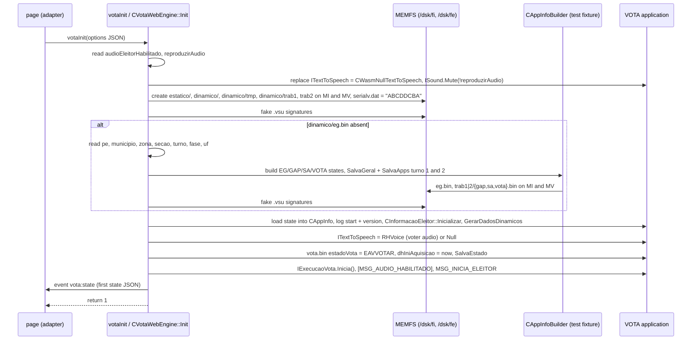

# u29: the web platform, part 2 — `votaInit`, the state JSON, and the functions the tools filed with the web entry point

Unit u29 has 110 wasm functions (52,212 bytes of code). The tools gave all of them the title "web platform:
`uenux2/wasm/vota_web` + `uenux2/mock/app/simulador`" and the group "free functions", because they were
attributed by their callers: most are called from `votaInit` (func 7840), from the web mocks
(`simulador::CWasm*`) or from the web test fixture (`comum::teste::CAppInfoBuilder`). Reading them shows
that **only about a third is web-platform code**. The rest is library code (SQLite, libc++ `<format>`) and
application classes that the web code happens to call. Units u28, u30 and u31 hold the rest of the web
platform (`main`, `votaTick`, `votaPressKey`, the `CWasm*` classes).

| group | functions | bytes | what they are |
|---|---:|---:|---|
| web entry point `vota_web_wasm.cpp` | 12 | 15,027 | `votaInit` (`CVotaWebEngine::Init`), the state-JSON builder, the JSON escaper, the engine singleton (+ its `unique_ptr` instantiations and static destructor), event emission, two forwarders to TSE imports |
| web mocks `mock/app/simulador/wasm` | 12 | 10,683 | resource-path resolver and file reader, Latin-1 to UTF-8 for the canvas, path scaling, the in-memory log bus, the two exported audio-wait callbacks, static destructors, `CSimuladorWasm` constructor |
| web test fixture `mock/app/comum/cappinfobuilder.cpp` | 5 | 1,214 | `Converte(EMidia)`, the merged "save both turnos" wrapper, the builder's destructor, two copy helpers |
| application classes (`comum`, `vota`, `api`, `ecourna`) | 27 | 2,533 | state services (`CServicoEstadoGeral*`) and state records (`CEstadoGeral`, `CDadoCorrespondencia`, …) used by the fixture; `CCandidaturas::GetInst`; `CPath`; `IForm<IScreen>` stack helpers; `CPolySingletonList::push<>` heads; `CStringUtils::ToUpper` |
| **SQLite** (mis-attributed) | 28 | 18,344 | R*Tree module (insert/split, cursor heap, node cache), date functions, JSON label compare, `ALTER TABLE RENAME` editing, window functions |
| **libc++** (mis-attributed) | 25 | 3,954 | `<format>` Unicode internals (grapheme clusters, escaped output), `std::filesystem` helpers, container instantiations |
| **RHVoice** (mis-attributed) | 1 | 457 | `speech_processor::insert` |

43 of the 110 ran during the recorded votes (`analysis/runtime/*.functions.tsv`), among them `votaInit`, the
state-JSON builder and escaper, the resource resolver, the log bus, the state services (constructors 3787/5812/3897,
`Salva` 2894/3592/5329) and the fixture's copy helpers 5324/9862. The md model constructors those helpers call
(5629, 5109, and 5630/5632) are not in the samples: the 20 µs sampling profiler misses such tiny functions, so an
empty "run" cell does not mean "never executed".

Reconstructed sources (the `.u29` suffix marks a fragment of a file shared with other units):

```
src/uenux2/wasm/vota_web/vota_web_wasm.u29.cpp                  CVotaWebEngine, votaInit, BuildStateJson, EscapeJson, ... (7840 5500 9640 5408 5521 3533 2094 9646 9649)
src/uenux2/mock/app/simulador/wasm/cwasmresource.u29.cpp        ResolveCaminho 2626, NomeGifMulher4 4996, LeArquivo 3452      (path inferred)
src/uenux2/mock/app/simulador/wasm/cwasmscreen.u29.cpp          EscalaCaminho 5113, Latin1ParaUtf8 5098                         (path inferred)
src/uenux2/mock/app/simulador/wasm/cwasmlogbus.u29.cpp          CWasmLogBus::Publica 5152                                        (path inferred)
src/uenux2/mock/app/simulador/wasm/cwasminit.u29.cpp            LogComando 1524                                                  (path inferred)
src/uenux2/mock/app/simulador/wasm/cwasmwebsound.u29.cpp        uenux_wasm_web_sound_wait_finished 9604 / _cancel_requested 9614 (path inferred)
src/uenux2/mock/app/simulador/wasm/cwasmthread.u29.cpp          s_threads (static dtor 9662)
src/uenux2/mock/app/comum/cappinfobuilder.u29.cpp               Converte(EMidia) 5344, merged SalvaApps wrappers 6004, ~CAppInfoBuilder 5644,
                                                                copy helpers 5324/9862
src/uenux2/src/app/comum/appinfo/servicos/iservicoestado.u29.h  IServicoEstado::Salva 2894, per-turno ctor 3897, 1941 3787 5812 3592 5329 (path inferred)
src/uenux2/src/app/comum/dados/md/estadoaplicacao/*.u29.cpp     ~CEstadoGeral 2793, CDadoCorrespondencia 5630, CDadoLocal 5632,
                                                                CNumViasImpressasRelatorios 5629, CEstadoGeralVota::MarcaInicioAquisicao 5627
src/uenux2/src/app/comum/dados/ccandidaturas.u29.cpp            CCandidaturas::GetInst 521
src/ecourna/app/dados/midias/cidentificadorgeradormidia.u29.cpp CIdentificadorGeradorMidia 5109                             (path inferred)
src/ecourna/api/util/cstringutils.u29.cpp                       CStringUtils::ToUpper(const std::string&) 5156
```

Functions already reconstructed by other units are only mapped (§13): `CPath` (762, 1082, 5899, 6047 → u22),
`CInformacaoEleitor::DesabilitaAudio` (4195 → u07), `IForm<IScreen>` (5056, 5069, 8902 → u17),
`CSimuladorWasm` (8311 → u19). Library functions get no source file; the table gives the library symbol.

---

## 1. Purpose, and the Portuguese terms

The simulator page (`upstream/site/vota-wasm.html`) runs the urna's voting application compiled to
WebAssembly. JavaScript talks to it through five exported C functions (`docs/03-js-wasm-interface.md`).
This unit contains the most important of them, **`votaInit`**, which turns an empty in-memory filesystem
plus an election scenario into an urna that is **ready for one voter**, and **the state JSON** that tells
the page what the voter is doing so that it can show its guide.

Terms used below:

* **urna / UE**: the voting machine. **eleitor**: voter. **mesário**: poll worker, who normally opens the
  vote, identifies each voter and releases the urna (message `MSG_INICIA_ELEITOR`).
* **cargo**: office being voted (Vereador, Prefeito, Deputado…). **proporcional** (party-list) vs
  **majoritário** (most votes). **legenda**: a vote for a party only (2 digits in a proportional office).
  **branco**: blank vote. **nulo**: null vote. **candidato inapto**: candidate whose votes are void.
* **pleito / PE (processo eleitoral)**: the election event (2400 municipal, 2500 general in the scenarios).
  **turno**: round (1 or 2). **fase**: `oficial` (1), `simulado` (2) or `treinamento` (3, training).
* **UF**: state; **município**, **zona** (electoral zone), **seção** (polling station).
* **MI / MV** (also FI / FE): *mídia interna* (internal flash, `/dsk/fi`) and *mídia de votação* (the
  removable card, `/dsk/fe`); `comum::EFlashOrigem` 0 / 1. **estático / dinâmico**: read-only election data / work area.
* **eg.bin, vota.bin, gap.bin, sa.bin**: the persistent state files (*estado geral* of the urna, of the VOTA
  application, of GAP and SA). **.vsu**: their signature files. **carga**: the preparation of the urna's
  media, recorded as *correspondência*.
* **aquisição (de votos)**: vote collection; `dhIniAquisicao` is when it started.
* **RHVoice**: the speech synthesiser used for the voter's audio guidance (accessibility, *áudio do eleitor*).

---

## 2. Classes and how they relate

RTTI exists only for polymorphic classes; the web-entry classes are in an anonymous namespace.

```
(anonymous namespace)::CVotaWebEngine            40 bytes, not polymorphic; singleton std::unique_ptr @1832600
(anonymous namespace)::CPoliticaExecucaoEleitorWeb, CWasmSavd, CSincronismoVotoEleitorWeb   (units u28/u30)

simulador::CWasmResource : api::IResource        vtable @1530184  -> helpers 2626 / 4996 / 3452 (this unit)
simulador::CWasmScreen   : api::IScreen          vtable @1528824  -> helpers 5113 / 5098 (this unit)
simulador::CWasmInit     : comum::IInterfaceInit vtable @1528772  -> logger 1524 (this unit)
simulador::CWasmLogd     : api::CEscritorLog     vtable @1530808  -> log bus channel 2
simulador::CWasmWebSound : api::ISound           (u31) + simulador::(anon)::CEsperaAudioWasm : api::IEsperaAudio
simulador::CWasmLogBus                           no RTTI, static object @1832676, see §6.3 (name inferred)

comum::IServicoEstado<ESTADO, CONVERSOR>         (path inferred iservicoestado.h; one instantiation per file)
 ├ comum::CServicoEstadoGeral        eg.bin    vtable @1558024   (8 bytes)
 ├ comum::CServicoEstadoGeralVota    vota.bin  vtable @1558064   (12 bytes: + turno)
 ├ comum::CServicoEstadoGeralGap     gap.bin   vtable @1558120   (12 bytes)
 └ comum::CServicoEstadoGeralSA      sa.bin    vtable @1558176   (12 bytes)
   (RTTI: each service is "si" with its IServicoEstado<…> instantiation as DIRECT base; there is no
    intermediate per-turno class. The three per-turno constructors share one merged body, func 3897.)

comum::teste::CAppInfoBuilder (500 bytes, test fixture, u28 header) holds by value:
   CEstadoGeral m_geral (+0, 180 B) · CEstadoGeralGap m_gap[2] (+180, 44 B) · CEstadoGeralSA m_sa[2] (+268)
   · CEstadoGeralVota m_vota[2] (+300, 100 B)
CEstadoGeral ⊃ CDadoLocal (+8) ⊃ CLocalidadeEleitoral (+20) · CDadoCarga (+32) · CAjusteDataHora (+52)
             · CDadoCorrespondencia (+60, 96 B) ⊃ ecourna::app::dados::CIdentificadorGeradorMidia (+60 of it)
```

### 2.1 `CVotaWebEngine` (40 bytes)

| offset | member (name inferred) | meaning | written by |
|---:|---|---|---|
| +0 | `bool m_initialized` | `votaInit` succeeded | `Init` (a 16-bit store of 1 also clears +1) |
| +1 | `bool m_done` | the voter finished | `votaTick` |
| +2 | `bool m_audioEnabled = true` | option `reproduzirAudio`; `ISound` is muted when false | `Init`, `SetAudioEnabled` |
| +3 | `bool m_audioEleitorHabilitado` | option `audioEleitorHabilitado` (voter audio with RHVoice) | `Init` |
| +4 / +5 | `bool m_recordingStarted / m_recordingFinished` | web-only "Gravando…" animation | `votaTick` |
| +8 | `int m_recordingStep` | progress-bar step 0…4 | `votaTick` |
| +16 | `double m_recordingDeadline` | `performance.now()` deadline | `votaTick` |
| +24 | `std::string m_lastJson = "{}"` | last JSON sent to the page | `Init`, `votaTick`, `votaGetStateJson` |

`GetInst` (func 2094) creates it lazily with `std::make_unique` (the value-initialisation shows as a
`memset(0, 40)` followed by the two default member initialisers). Funcs 4954/5101 are the
`unique_ptr::reset`/`~unique_ptr` instantiations, and 9832 the `atexit` destructor of the static.
The two attested method names (`Init`, `SetAudioEnabled`) are English, so the inferred names in this file
follow that style.

---

## 3. `votaInit` step by step (func 7840, `CVotaWebEngine::Init`, srcloc `vota_web_wasm.cpp:515`)

`votaInit(const char* json)` is `CVotaWebEngine::GetInst().Init(json)` with `Init` inlined. The page calls
it once, after mounting the scenario, with (municipal-t1):

```json
{"fase":"te","pe":2400,"turno":1,"uf":"ac","municipio":1,"zona":1,"secao":1,"audioEleitorHabilitado":false,"reproduzirAudio":false}
```

Every step is inside one `try`: a `std::exception` is reported with `ReportError(e.what())` (func 10857:
`console.error` + event `vota:error`) and `votaInit` returns 0; anything else reports
`"erro desconhecido em votaInit"`.



1. **Audio options.** `audioEleitorHabilitado` (default false) → +3; `reproduzirAudio` (default true) → +2.
   The readers are hand-written string searches (u30), not a JSON parser.
2. **Speech engines.** `replace<ITextToSpeech>(make_unique<CWasmNullTextToSpeech>())`, through the
   register-or-replace wrapper of u19 §3.4 (by-value helper 4162 → `replace<ITextToSpeech>` 7667: `exists` →
   `erase` → inlined `push`). It replaces the null engine that `main` registered through func 8302
   (`simulador::CSimuladorWasm::Executa`); a plain `push` would throw 6756
   `"{}: instância já criada de {}"` on the duplicate. Then
   `CPolySingleton<ISound>::instance(info, source_location::current()).Mute(!reproduzirAudio)` — the call
   whose default argument produced the only srcloc of `Init` (line 515).
3. **Storage tree**, for MI (0) and MV (1): `create_directories` of `CPath::GetPathEstatico`,
   `GetPathDinamico`, `GetPathDinamico / "tmp"`, `GetPathTrab(flash, '1')`, `GetPathTrab(flash, '2')`, then
   `WriteFileIfMissing(GetPathRootSemSA(flash) / "serialv.dat", "ABCDDCBA")` (func 11818). The scenario
   package already ships `/dsk/fi/serialv.dat` with the same text; on MV the adapter's symlink provides it.
   Then `WriteSimulatedSignatures()` (func 11733, u30): `uenux.vsu`, `vota.vsu`, `rdv.vsu`, `eg.vsu`,
   `gap.vsu`, `sa.vsu` containing `assinatura simulada para vota_web_wasm`.
4. **Fabricated persistent state**, only if `/dsk/fi/dinamico/eg.bin` does not exist:
   * reads `pe`, `municipio`, `zona`, `secao`, `turno` (integers, default 1), `fase` (default `"te"`) and
     `uf` (default `"ee"`);
   * `fase`: `"oficial"`/`"o"` → `'1'`, `"simulado"`/`"s"` → `'2'`, anything else → `'3'` (training);
   * `CAppInfoBuilder builder(pe)` (func 10268, u30: version `"7.2.1.3 - TESTE EG ASN1"`; the
     correspondência of func 10261 is a constant test carga: número interno 87654321, série da FC
     `"12345678"`, carga 31/12/2020 23:59:58, código `"123456789012345678901234"`, seção 1/1/1, generator
     `{"nome_maquina", "12345678", "99999999"}` from func 9952), then `.SetFase(fase)` (EG +48) `.SetTurno(turno == 2 ? '2' : '1')` (EG +32)
     `.SetTipoUrna('1')` (EG +36/+40, tipo de urna T1/T2) `.SetLocal(municipio, zona, secao)` (EG +20/+24/+26);
   * `uf = CStringUtils::ToUpper(uf)` (func 5156) into EG +8 (`CDadoLocal::m_uf`);
   * for both turnos: `vota.estadoVota = '1'` (EAVINICIAL) and `vota.treinamentoEleitor = true` (+72) —
     every simulator session is *treinamento do eleitor* (voter training), whatever the `fase`;
   * `builder.Salva(false, {MI, MV})` (func 10256): `SalvaGeral` (eg.bin) and `SalvaApps` for turno 1 and 2
     (the merged wrapper 6004) → `trab1|2/{gap,sa,vota}.bin` on both flashes (u28 documents the files);
   * the fake signatures again, and `~CAppInfoBuilder` (func 5644).
5. **Load and start VOTA.** `CarregaAppInfo(CAppInfo::GetInst())` (mock func 11572, u30) reads the files
   back into `comum::CAppInfo`; `CLogVota` logs `"Iniciando aplicação - {}"` with the turno (func 11641)
   and `"Versão da aplicação: {}"` (func 11642); `vota::CInformacaoEleitor::Inicializar()` (func 7787, u02:
   loads the election data and builds `CTelasVota`, `CCargos`, `CCandidaturas`, …) and
   `GerarDadosDinamicos()` (func 6737); fake signatures again.
6. **Voter audio.** If `audioEleitorHabilitado`: `/etc/RHVoice` and `/share/RHVoice` must exist (the page
   mounts `rhvoice-leticia.data` only when the accessibility option is on), otherwise
   `std::runtime_error("dados do RHVoice nao foram carregados para habilitar o audio do eleitor")`;
   then `replace<ITextToSpeech>(make_unique<api::CRHVoiceTextToSpeech>(path("/")))` (the same wrapper,
   4162 → 7667). Otherwise a fresh `CWasmNullTextToSpeech` replaces the current engine the same way.
7. **Open the vote.** `CAppInfo::GetVota(Atual).SetEstadoVota(EAVVOTAR)` (func 11266; the C++ enum is the
   ASN.1 value + `'1'`, so `votar (7)` is 56 = `'8'`), `MarcaInicioAquisicao()` (func 5627: `dhIniAquisicao
   = now` if unset), `comum::SalvaEstado()` (func 491: writes and "signs" `vota.bin` on MI and MV), fake
   signatures again. On the urna this state is reached only after the *zerésima* report and the mesários'
   registration.
8. **Release the urna for one voter.** `IExecucaoVota::GetInst()` is the web policy
   `CExecucaoVotaCooperativa` (registered by `main`): slot 3 `Inicia()` installs the first voter state
   (`CAguardaMensagem`). Then, on the voter queue (`GetFilaEleitor()`, slot 8):
   `MSG_AUDIO_HABILITADO` (9) if voter audio is on, else `CInformacaoEleitor::DesabilitaAudio()` (func 4195);
   and always `MSG_INICIA_ELEITOR` (1). **On the urna this message is sent by the mesário's terminal after
   identifying the voter** (`CNomeEleitor`, `CDigitalReconhecida`, `CControlaReconhecimento`). The web build
   has no voter identification, no biometrics and no mesário.
9. `m_initialized = true; m_done = false; m_lastJson = BuildStateJson(); EmitEvent("vota:state", m_lastJson)`,
   return 1. The first state is still `vota::CAguardaMensagem`; the first `votaTick` processes message 1.

**`votaInit` works once per module instance** (verified, §11): a second call reaches step 5 and fails with
`CTelasVota - instancia ja criada` (`CTelasVota::CreateInst`), because `CInformacaoEleitor::Inicializar` is
not re-entrant; the fixture of step 4 is skipped because `eg.bin` exists. The page therefore reloads between
voters ("Refazer votação" → `location.reload()`).

---

## 4. The state JSON (func 5500, `BuildStateJson`)

Called by `votaInit`, `votaTick` (after each step; the event is sent only when the state name or the text
changed) and `votaGetStateJson`. Format and field list are in `docs/03-js-wasm-interface.md` §13; this is how
each field is computed.

* `state` = `CurrentStateName()` (func 5408): the voter thread's current state (`IExecucaoVota` slot 9) →
  `typeid(*estado).name()` → `DemangleTypeName` (func 5521, `abi::__cxa_demangle`, falls back to the mangled
  name). `""` if there is no state.
* `substate`: only if the state is `vota::CEleitorVotando` — the test is a compare with its vtable
  (@1533152): `CEleitorVotando` is `final`, and clang turned `dynamic_cast` into a vptr comparison. Its
  per-cargo sub-state (+12, `m_estadoCargo`) is demangled the same way.
* `screen` = `"accessibility"` when `substate` contains `CInstrucaoVotacaoAcessibilidade`.
* `proporcional` = current cargo has a candidate detail (`optional` flag +84) **and** `tipo == 1`. Guarded by
  `CCargos::IsEnd()`; any exception is swallowed.
* `guide.legendaValida` = proporcional **and** at least two digits typed **and** `LegendaValida(cargo,
  ToWord(g_votoDigitado.substr(0, 2)))` (func 5922, name inferred: the party exists in `CPartidos` and has a
  candidacy with field +72 == 0 for this cargo).
  `vota::g_votoDigitado` (@1833288) is the voting code's own buffer of typed digits. Exceptions → false.
* `guide.voteMode`, first rule that matches: not initialised → `inicio`; done → `fim`; recording started
  (+4) or `state` contains `CSincronismo` → `gravando`; screen accessibility → `accessibility`; `substate`
  contains `Branco` → `branco`; `CPedeNominal` → `legendaOuNominal` if proporcional and legendaValida, else
  `nulo`; `VotoLegenda` or `CandidatoInexistente` → `legenda` / `nulo` by the same test; `Nulo`,
  `Inexistente`, `Inapto` or `Repetido` → `nulo`; otherwise `nominal`.
* `guide.confirmacao` = `substate` contains `VotoNominal` or `MajoritarioValido` (false on the legenda,
  branco and nulo confirmation screens; the adapter has its own checks for those).
* `cargo` (only when no `screen` and `!IsEnd()`): `id` = `GetCodigo()` (+0), `name` = `GetNome()` (func
  1547), `digits` = +12, `tipo` = `proporcional`/`majoritario` by the same test, `,"legendaDigits":2` for
  proportional offices (a constant text).
* `candidates`: built in a second `ostringstream`. `GetNumerosCandidatos(cargo)` (func 2840, name inferred) lists the
  numbers of this cargo's candidacies **whose field +72 is 0**; each is looked up with the key
  `cargo·1000000 + número` (`CCandidaturas::Chave`, func 1939) and printed as
  `{"number":…,"name":…,"party":…,"apt":…}` (`number` +24, `name` +40, `party` u16 +22 of the map node,
  `apt` = field +72 == 0 — so it is **always true**). The list is `[]` on the accessibility screen. An
  exception while listing (CCandidaturas lookups, stream writes) is caught by an inner `catch (...)` that still
  closes the list with `]` (a truncated but valid list); an exception in the `cargo` block goes to the outer
  handler, which appends `,"candidates":[]` (see §12 item 4).

All string values go through `EscapeJson` (func 9640): `\" \\ \b \t \n \f \r`, other bytes below 0x20 as
`\u00XX` (4 digits), **bytes ≥ 0x80 as `\u00XX`**: the application's text is Latin-1 and the JSON is pure
ASCII, so `JSON.parse` yields the right characters (`"Gin\u00e1stica"` → "Ginástica").

---

## 5. Other functions of `vota_web_wasm.cpp` in this unit

| func | name (inferred) | what |
|---:|---|---|
| 3533 | `EmitEvent(nome, json)` | the only caller of import `js_emit_event`; used for `vota:ready`, `vota:state`, `vota:done`, `vota:error`, `vota:screen` |
| 9646 | `ConsoleError(texto)` | `js_console_error(texto.c_str())` for `ReportError`: prints the **raw** Latin-1 text (U+FFFD in the console, 03 §7.4) |
| 9649 | `PushKey(tecla)` | `js_push_key(tecla.c_str())` for `votaPressKey`: the key goes back to JavaScript's queue `Module.uenuxKeys` |
| 2737 / 3355 | — | `std::string::find(const char*)` / `find(const std::string&)` out-of-line instantiations, used by `BuildStateJson`/`votaTick` and by the JSON readers |
| 9507 / 9437 | — | head parts of `CPolySingletonList::push<IPoliticaExecucaoEleitor>` / `push<ISincronismoVotoEleitor>` called by `main` (u19 §3.4) |
| 5120 | — | `std::function<void()>::~function` for `main`'s lambda |

---

## 6. The web mocks' helpers

### 6.1 Resources: `ResolveCaminho` (2626), `NomeGifMulher4` (4996), `LeArquivo` (3452)

`simulador::CWasmResource` (u31) serves `api::IResource` from MEMFS. Every lookup first resolves the
application's resource name:

1. strip every leading `:` (Qt resource syntax `:/resource/...`), prepend `/` if missing;
2. candidates: the path itself; for `/resource/images/X`: `/uenux/app/img/X`, `/pkg/img/X`; for
   `/resource/gifs/X`: `/pkg/gifs/X`, the path with `Mulher4` inserted before the last `.gif`, and
   `/pkg/gifs/` + X with `Mulher4`; duplicates removed (`std::unique`);
3. the first candidate that an `std::ifstream` can open wins → `js_resource_log("resolve", nome, caminho,
   -1)`; none → `js_resource_log("missing", nome, "", -1)` and `""`.

The package ships only `/uenux/app/img/**` and `/resource/gifs/*Mulher4.gif`; `/pkg/…` does not exist (a
leftover of another layout). Every instruction animation is therefore replaced by its **"Mulher4"** (woman
#4) avatar. At most 4 candidates are probed (images 3, GIFs 4); in practice an image resolves at the 2nd
(`/uenux/app/img/`) and a GIF at the 3rd (the `Mulher4` path). `LeArquivo` then opens the chosen file once
more and reads it into a `std::vector<unsigned char>` through `istreambuf_iterator` (byte by byte; the GIFs are
0.83 MB (`vereadorMulher4.gif`) to 1.58 MB (`votoNuloMulher4.gif`)).

### 6.2 Screen: `EscalaCaminho` (5113), `Latin1ParaUtf8` (5098)

`EscalaCaminho` multiplies a path (`api::SPathElement`: MoveTo / LineTo / ArcTo(rect, start°, sweep°) /
Close, 56 bytes) by `sx`/`sy` (CWasmScreen +16/+24) before `js_path`; unknown element types are dropped.
`Latin1ParaUtf8` converts every text for `js_text`/`js_measure_text_width` (bytes ≥ 0x80 → 2-byte UTF-8).

### 6.3 The log bus (5152) and `CWasmInit`'s logger (1524)

A static object at 1832676 (168 bytes; guard byte 1832844; destroyed by func 5154): a mutex (no-op) and
three channels of `{deque<string> historico; unordered_map<int, function<void(const string&)>> ouvintes;
int proximoId = 1}`. `Publica(canal, texto)` stamps `"[%Y-%m-%d %H:%M:%S] "` (local time), appends, keeps at
most **2000 lines**, and calls the channel's listeners outside the lock. Channel 0 receives
`"CWasmInit::{comando} {resposta}"` from `CWasmInit::EnviarMensagem` (via 1524), channel 2 every line of the
application log after `CWasmLogd` writes it to `logd.dat`. **No function in the binary registers a
listener** (the maps are only read and destroyed), so in this build the bus is a bounded in-memory history
that nobody reads — the subscribe side (probably for a debug panel) was not linked.

### 6.4 Audio waits: the exports `uenux_wasm_web_sound_wait_cancel_requested` (9614) and `_finished` (9604)

`CWasmWebSound`'s wait (slot 9, u31) stores `{std::function<bool()> cancelado, std::function<void(bool)>
fim}` under a new id in `std::map<int, …>` @1832664 and calls `js_wasm_web_sound_wait_async(id)`. The glue
polls every 20 ms: `cancel_requested(id)` returns `cancelado()` (0 for an unknown id); `finished(id, ok)`
moves `fim` out, erases the entry, then calls `fim(ok != 0)`. The two callbacks registered by the voting
code are `vota::CVotacaoStateAudio::IniciarEsperaFimAudio()::$_0` / `$_1` (RTTI of the `std::function`
targets). Func 9631 is the map's static destructor.

### 6.5 Threads

Func 9662 frees the static `std::vector` @1832648 in which `CWasmThread::Create` records each "thread"
(`{rotina, argumento, 0, id}`): without pthreads nothing runs in parallel; the voter thread is stepped by
`votaTick`.

---

## 7. The fixture support in `comum` (state files)

The web build writes the urna's persistent state with the same classes as the urna (u20, u05):

| file | ASN.1 type | service (vtable) | md class | Salva entry |
|---|---|---|---|---|
| `<flash>/dinamico/eg.bin` | `ModuloEstadoGeralUrna.EstadoGeralUrna` | `CServicoEstadoGeral` (@1558024) | `CEstadoGeral` 180 B | 3592 → 2894 |
| `<flash>/dinamico/trab<t>/vota.bin` | `ModuloEstadoGeralVota.EstadoGeralVota` | `CServicoEstadoGeralVota` (@1558064) | `CEstadoGeralVota` 100 B | 5329 → 2894 |
| `<flash>/dinamico/trab<t>/gap.bin` | `ModuloEstadoGeralGap.EstadoGeralGap` | `CServicoEstadoGeralGap` (@1558120) | `CEstadoGeralGap` 44 B | 10112 → 2894 |
| `<flash>/dinamico/trab<t>/sa.bin` | `ModuloEstadoGeralSA.EstadoGeralSA` | `CServicoEstadoGeralSA` (@1558176) | `CEstadoGeralSA` 16 B | 10089 → 2894 |

* `Salva` (merged body 2894): `GetPathArquivo()` (vtable slot 2), a stateless converter object on the stack
  (`CConversorEstadoGeral*`), `Converte(estado)` to the ASN.1 entity, `CFileASN::WriteToFile(path, entity)`
  (BER, file mode `"wb"`, func 2892).
* Per-turno service constructors (merged body 3897: 3787 vota, 5812 gap, 11566 sa) store `{vptr, flash,
  turno}`; **turno `'3'` (atual)** is resolved at construction by reading `eg.bin` **of the same flash**
  (`CServicoEstadoGeral(flash).Carrega()`, +32). These are three separate constructors (one per
  `cservicoestadogeral{vota,gap,sa}.cpp`) that wasm-opt merged because only the vtable constant differs; the RTTI
  rules out a common per-turno base class. `GetPathArquivo()` is not `const` (srcloc signature at line 32 of
  each file), so `Salva`, which calls it through slot 2, cannot be a `const` member either.
* Model constructors used when the builder copies its states before saving: `CDadoCorrespondencia`
  (5630, 96 B: número interno da urna, número de série da FC, data/hora da carga, código da carga, seção
  da carga, assinatura, identificador do gerador de mídia), `CDadoLocal` (5632: UF, município/zona/seção,
  tipo de local), `CNumViasImpressasRelatorios` (5629: copies printed of four reports),
  `CIdentificadorGeradorMidia` (5109: nome, serial do certificado TPM, serial de instalação). The fixture's
  leaf copy helpers 5324 and 9862 rebuild the last two through these constructors.
* `CEstadoGeralVota::MarcaInicioAquisicao` (5627) is also called by the urna's own `CInicioVotacao`.

---

## 8. Library code the tools filed here

The callers of these functions made the classifier put them in `app:wasm-entry`/`app:simulador`. They are
not TSE code.

* **SQLite 3.50.4** (the urna keeps `uenux.db` for mesário attendance and justifications, u24):
  R*Tree — `rtreeInsertCell` (2973, with `SplitNode` inlined), `AdjustTree` 6289, `fixBoundingBox` 6287,
  `updateMapping` 6288, `nodeInsertCell` 6290, `nodeWrite` 4002, `nodeRelease` 583, `rowidWrite`/`parentWrite`
  3999/4000, `SortByDimension` 4001, `nodeGetRowid` 6303, cursor heap `rtreeSearchPointPop/New` 4004/4005,
  `rtreeEnqueue` 6293, `rtreeStepToLeaf` 6297, `resetCursor` 6299; dates — `computeJD` 1090,
  `computeYMD_HMS` 1299, `getDigits` 1424, `parseHhMmSs` 4016; JSON — `jsonLabelCompareEscaped` 4011;
  `ALTER TABLE … RENAME` — `renameEditSql` 4019, `renameWalkTrigger` 4020; `valueFromValueList` 6547;
  window functions — merged bodies 6073 (`first_value`/`nth_value` finalize) and 6074 (`row_number` value /
  `count` finalize), ICF bodies 6325 (`percent_rank`/`cume_dist` inverse) and 6326 (their step). None of
  them runs in a vote (the R*Tree, JSON and window code are compiled in by the Conan recipe's defaults,
  docs/libraries/sqlite.md).
* **libc++ `<format>`**: Unicode helpers used to compute the display width of formatted strings —
  `__code_point_view::__consume` 2905, `__is_continuation` 3878, grapheme-cluster rules
  `__evaluate_none` 2874, property lookups 3866/3868 (merged body 6072), escaped output
  `__write_escaped_code_unit` 5927 (+ 5926, 5933), `basic_format_context::locale()` 2292.
* **libc++ other**: `std::filesystem::operator/` 5968, `path::parent_path` 3706, vector/unique_ptr/deque/
  exception-guard instantiations (520, 1698, 2662, 2670, 2720, 3501, 4954, 5101, 5120, 5150, 5294, 5532,
  6005).
* **RHVoice**: `speech_processor::insert` 2209 (it shares the ICF body 2662 with `CWasmScreen`).

---

## 9. Boletim de urna (BU)

This unit does not generate, sign or print a BU, and the web flow never reaches the *encerramento*: the page
serves one voter and reloads. It matters for the BU in one way: **`votaInit` fabricates the identity data
that a BU would carry**. `eg.bin` receives the options `pe` (idPE), `uf`, `municipio`, `zona`, `secao`,
`turno`, `fase` and the fixture's constants (version `"7.2.1.3 - TESTE EG ASN1"`, tipo de urna `'1'`, a
constant test carga: urna 87654321, carga dated 31/12/2020 23:59:58, code `"123456789012345678901234"`,
generator `"nome_maquina"`; funcs 10261/9952, u30), and `vota.bin` gets `treinamentoEleitor = true`, `estadoVota = EAVVOTAR` and `dhIniAquisicao`. The BU
code (`CGeraBU`, u08) reads exactly these fields (município/zona/seção, turno, fase, carga history of
`gap.bin`) when it builds `EntidadeBoletimUrna`. The `.vsu` signatures next to them are the literal text
`assinatura simulada para vota_web_wasm`, and `CWasmSavd` (u28) accepts every signing and validation
request.

---

## 10. Web-build and wasm observations

* **The web build skips the mesário.** `votaInit` sets the states that the zerésima, the mesário
  registration and the voter identification would produce, then posts `MSG_INICIA_ELEITOR` itself.
* **Class names are an interface.** The page's guide depends on substrings of demangled C++ class names
  (`CPedeNominal`, `VotoLegenda`, `CSincronismo`, …). Renaming a state class changes what the page tells the
  voter, without any compile error.
* **merge-similar-functions** produced several bodies with constants as parameters: 3897 (constructors, the
  vtable is a parameter), 2894 (Salva: two table slots and a vtable), 6004 (turno), 6005 (a `__vallocate`
  slot), 6072 (Unicode table shape), 6073/6074 (SQLite aggregate sizes). Their thunks live in other units.
* **Constant `this`.** `CWasmLogBus::Publica` (5152) has no `this` parameter: the only instance is a static,
  and the optimiser propagated its address (1832676) into the body.
* **`dynamic_cast` to a `final` class** became a vtable-pointer compare in `BuildStateJson`.
* **Static destructors** registered with `atexit`: 9832 (engine), 9631 (audio waits), 9662 (threads),
  8592/8910 (`IForm<IScreen>` stack and observable). They only run if the runtime exits, which it never does
  in the page (`noExitRuntime`).
* **Exceptions** cross only as far as the exports: every `try` in this unit is the `invoke_*` +
  `__THREW__` pattern; `votaInit` and `BuildStateJson` each contain 109 `invoke_*` call sites (each one a
  round trip through JavaScript when executed).

---

## 11. Checked by running the simulator

Commands run from the project root with `tools/run/headless.mjs` (copies patched in a scratch directory, the
repository unchanged):

| experiment | result |
|---|---|
| `votaInit` twice (second call `{"fase":"oficial","pe":9999,…}`), then a third call `{"audioEleitorHabilitado":true}` | both extra calls return 0 with `vota:error` `static void vota::CTelasVota::CreateInst():3435:1304 - CTelasVota - instancia ja criada`; the scenario options of the second call (`fase`, `pe`, …) are never read (eg.bin exists), but its audio options are: `reproduzirAudio` is absent, defaults to true, and the next `vota:state` already reports `"audioEnabled":true` (re-checked 2026-09-23). After the third call the next `vota:state` reports `"audioEnabled":true,"audioEleitorHabilitado":true` although no RHVoice engine was installed (the flags are written before the failure) |
| first `votaInit` with `audioEleitorHabilitado: true` and no voice package | returns 0, `vota:error` `dados do RHVoice nao foram carregados para habilitar o audio do eleitor`; `votaTick` then returns 0 and the state is `{"state":"",…,"voteMode":"inicio"}` |
| first `votaInit` with `"uf":"xyz"` | returns 0: the ASN.1 layer rejects it when `eg.bin` is encoded (`…DadoLocal.uf Campo AbstractString possui tamanho 3 maior que seu limite superior 2`) |
| first `votaInit` with `"zona":70000` | returns 0: `zona` is narrowed to 16 bits (70000 → 4464) without any check, and loading fails on `/dsk/fi/estatico/0000144640001-lo.dat` ("não existe") |
| first `votaInit` with `"zona":65537` (re-checked 2026-09-23) | returns **1**: the value silently becomes zone 1 and the session runs normally |
| first `votaInit` with `"fase":"oficial"` (municipal-t1, 2026-09-23) | returns 0: the fixture writes an official-phase (`'1'`) `eg.bin`, then loading fails on `/dsk/fi/estatico/o02400-cp.dat` ("não existe"), because the shipped data are training (`t…`) files. `"fase":"of"` (the code the adapter's `waitForScenarioData` uses for an official scenario) is not recognised by `votaInit` and becomes training (`'3'`): returns 1 |
| `--scenario geral-t1 --auto blank --full`, `--scenario municipal-t2 …` | every `apt` value in the events is `true` (159 + 10 occurrences), as the code implies; cargo ids 1, 3, 5, 6, 7 (general) and 11 (municipal round 2) |

```sh
node tools/run/headless.mjs --scenario geral-t1 --auto blank --full --events | grep -o '"apt":[a-z]*' | sort | uniq -c
```

---

## 12. Suspicious or noteworthy code

1. **`votaInit` is single-shot and leaves a half-updated engine on failure** (func 7840). A second call fails
   in `CInformacaoEleitor::Inicializar` (`CTelasVota - instancia ja criada`), but before that it has
   rewritten `m_audioEleitorHabilitado`/`m_audioEnabled`, replaced the TTS by a null one, re-muted `ISound`, and
   re-written the `.vsu` files; `m_initialized` stays true, so `votaTick` goes on and the JSON reports audio
   settings that are not in effect. The scenario options (`pe`, `uf`, `municipio`…) are silently ignored
   whenever `eg.bin` already exists. Impact: simulator only (the page reloads per voter). Low.
2. **The simulator skips the mesário and forces "treinamento do eleitor"** (7840). `MSG_INICIA_ELEITOR` is
   posted by `votaInit` itself; `treinamentoEleitor = true` is written for both turnos even when the option
   `fase` is `"oficial"`. Verified (§11): `"oficial"` does produce an official-phase `eg.bin` (with the fake
   `.vsu` signatures), but with the shipped training data the start-up then fails on the missing `o…` files, and
   the `eg.bin` left behind makes any later `votaInit` in the same page skip the fixture. Not reachable from the
   page with the shipped scenarios (all send `"te"`), reachable from any script calling `votaInit`. Note also a
   mismatch between the two sides: the adapter treats a scenario `"fase":"of"` as official when it waits for
   the data files (`o…-pu.dat`), while `votaInit` only accepts `"oficial"`/`"o"` and turns `"of"` into
   training. Info.
3. **Page guidance derived from C++ class names** (5500). `voteMode`, `confirmacao` and `screen` are
   substring tests on demangled RTTI names; e.g. `confirmacao` is false on the legenda/branco/nulo
   confirmation screens, and any class renamed or added (a sub-state whose name contains `Nulo`, `Branco`,
   `Inapto`…) changes the guide shown to a voter in training. Misleading-UI risk, simulator only. Low.
4. **Invalid JSON on a late exception** (5500). The outer `catch (...)` around the `cargo`/`candidates` part
   appends `,"candidates":[]` after whatever was already written. An exception after `,"cargo":{"id":…,"name":"`
   was written, i.e. from `CCargo::GetNome` (func 1547, which throws `"Não é cargo de consulta."` when the cargo
   has neither a candidate nor a consulta detail) or from a stream/allocation failure in that block, therefore
   yields an unterminated string/object. Exceptions from `CCargos::GetCurrent` (before anything is written) and
   from the `CCandidaturas` lookups (inner `catch (...)`, list closed with `]`) leave the JSON valid.
   `js_emit_event` then delivers `{raw, parseError}` to the page. Not observed. Low.
5. **`apt` is constant** (5500 + 2840). The candidate list keeps only candidacies whose +72 field is 0, and
   `apt` is computed from the same field, so it is always `true`; inapt candidates are never listed (the
   adapter ignores `apt` anyway). Dead field. Info.
6. **Log bus with no reader** (5152). Every application log line (channel 2) and init command (channel 0) is
   also kept in memory (≤ 2000 lines per channel, a copy of each line plus a `localtime_r` and an
   `ostringstream` per line), but no listener can be registered in this build. Bounded; wasted work. Info.
7. **Resource resolver probes non-existent paths** (2626). `/pkg/img/`, `/pkg/gifs/` never exist; each lookup
   probes up to 4 candidates with an `ifstream` (images 3, GIFs 4), the image/GIF readers then open the winner
   once more and read it byte by byte (3452). Performance only; the names come from the application, not from
   the user. Info.
8. **Unchecked narrowing of the options** (7840). `zona` and `secao` are read as `int` and stored as 16-bit
   values (`& 0xFFFF`, `SetLocal`, func 10176) with no range check: 70000 becomes zone 4464 (verified), 65537
   becomes zone 1 and passes (verified, `votaInit` returns 1). `uf` is only upper-cased; its length is caught
   later by the ASN.1 encoder. All integers are read by `JsonInt` (func 11571, u30) with `strtol`: a value with
   no digits falls back to 1, but there is no range or `errno` check. Simulator only. Low.
9. **Voter-audio check is shallow** (7840). Only the directories `/etc/RHVoice` and `/share/RHVoice` are
   tested (code); a partially mounted voice package passes this check and can only fail later, inside
   `CRHVoiceTextToSpeech` or at the first synthesis (not tested). Low.
10. **Exported wait callbacks trust the id** (9604/9614). Any page script can call
   `Module._uenux_wasm_web_sound_wait_finished(id, 1)` and complete (or cancel) a pending audio wait early,
   advancing the audio state machine. Harmless in a training page. Info.
11. **Security simulated** (context, 7840 → 11733, u28 `CWasmSavd`): the state files are "signed" with a
    fixed text and every SAVD request succeeds; `rdv.dat` is created at start-up but no vote is recorded in it
    (`CSincronismoVotoEleitorWeb`; after a vote only `logd.dat` changes, analysis/runtime/README.md). This
    is by design for the simulator and must not be read as the urna's behaviour. Info.

No `emscripten_sleep` path was found in the functions of this unit.

---

## 13. Complete mapping table (110 functions)

`run` = observed executing in the recorded votes. "library" rows are not reconstructed (the reason is given).
| # | func | size | run | tools name | reconstructed symbol | src file (or library + reason) | original file | conf. |
|---:|---:|---:|:---:|---|---|---|---|---|
| 1 | 520 | 35 | ✓ | `wasm_entry_f520` | `std::vector<T>::~vector (generic, via __destroy_vector 4967)` | library: template instantiation shared by ICF (15 callers of unrelated vector types) | libcxx <vector> | medium |
| 2 | 521 | 84 | ✓ | `wasm_entry_f521` | `comum::CCandidaturas::GetInst` | src/uenux2/src/app/comum/dados/ccandidaturas.u29.cpp | uenux2/src/app/comum/dados/ccandidaturas.cpp | high |
| 3 | 583 | 316 |  | `wasm_entry_f583` | `nodeRelease` | library: SQLite, see docs/libraries/sqlite.md | sqlite3.c (SQLite 3.50.4 amalgamation) (rtree.c) | high |
| 4 | 762 | 17 | ✓ | `wasm_entry_f762` | `comum::CPath::GetPathEstatico` | src/uenux2/src/app/comum/cpath.cpp (unit u22) | uenux2/src/app/comum/cpath.cpp | high |
| 5 | 1082 | 17 |  | `wasm_entry_f1082` | `comum::CPath::GetPathDinamico` | src/uenux2/src/app/comum/cpath.cpp (unit u22) | uenux2/src/app/comum/cpath.cpp | high |
| 6 | 1090 | 388 |  | `wasm_entry_f1090` | `computeJD` | library: SQLite, see docs/libraries/sqlite.md | sqlite3.c (SQLite 3.50.4 amalgamation) (date.c) | high |
| 7 | 1299 | 422 |  | `wasm_entry_f1299` | `computeYMD_HMS` | library: SQLite, see docs/libraries/sqlite.md | sqlite3.c (SQLite 3.50.4 amalgamation) (date.c) | high |
| 8 | 1424 | 275 |  | `wasm_entry_f1424` | `getDigits` | library: SQLite, see docs/libraries/sqlite.md | sqlite3.c (SQLite 3.50.4 amalgamation) (date.c) | high |
| 9 | 1524 | 705 | ✓ | `simulador_f1524` | `simulador::(anonymous namespace)::LogComando` | src/uenux2/mock/app/simulador/wasm/cwasminit.u29.cpp | uenux2/mock/app/simulador/wasm/cwasminit.cpp (path inferred) | medium |
| 10 | 1698 | 35 | ✓ | `mock_f1698` | `std::vector<comum::md::estadoaplicacao::CDadoCorrespondencia>::~vector` | library: template instantiation (96-byte elements; noted in src/uenux2/src/app/comum/dados/md/estadoaplicacao/cestadogeral.u29.cpp) | libcxx <vector> | medium |
| 11 | 1941 | 21 |  | `mock_f1941` | `comum::CServicoEstadoGeral::CServicoEstadoGeral` | src/uenux2/src/app/comum/appinfo/servicos/iservicoestado.u29.h | uenux2/src/app/comum/appinfo/servicos/cservicoestadogeral.h (path inferred) | high |
| 12 | 2094 | 159 | ✓ | `wasm_entry_f2094` | `(anonymous namespace)::CVotaWebEngine::GetInst` | src/uenux2/wasm/vota_web/vota_web_wasm.u29.cpp | uenux2/wasm/vota_web/vota_web_wasm.cpp | medium |
| 13 | 2209 | 457 |  | `simulador_f2209` | `RHVoice::speech_processor::insert` | library: RHVoice (ICF-merged vector<double>::insert 2662 is shared with CWasmScreen) | RHVoice src/core/speech_processor.cpp | medium |
| 14 | 2292 | 118 |  | `wasm_entry_f2292` | `std::basic_format_context<back_insert_iterator<__format::__output_buffer<char>>,char>::locale` | library: libc++ <format> Unicode internals | libcxx/include/__format/format_context.h | medium |
| 15 | 2626 | 3824 | ✓ | `simulador_f2626` | `simulador::ResolveCaminho` | src/uenux2/mock/app/simulador/wasm/cwasmresource.u29.cpp | uenux2/mock/app/simulador/wasm/cwasmresource.cpp (path inferred) | medium |
| 16 | 2662 | 821 | ✓ | `simulador_f2662` | `std::vector<double>::insert(const_iterator, const double*, const double*)` | library: range insert, ICF body shared by CWasmScreen::FillPath/DrawPath and RHVoice | libcxx <vector> | medium |
| 17 | 2670 | 359 | ✓ | `simulador_f2670` | `std::vector<api::SPathElement>::push_back` | library: 56-byte trivially copyable element | libcxx <vector> | medium |
| 18 | 2720 | 12 | ✓ | `wasm_entry_f2720` | `std::vector<comum::teste::EMidia>::vector(const vector&)` | library: thunk to merged copy-ctor body 6005 with __vallocate slot 220 | libcxx <vector> | medium |
| 19 | 2737 | 44 | ✓ | `wasm_entry_f2737` | `std::string::find(const char*, size_type)` | library: out-of-line instantiation (__str_find + strlen) | libcxx <string> | medium |
| 20 | 2793 | 39 |  | `mock_f2793` | `comum::md::estadoaplicacao::CEstadoGeral::~CEstadoGeral` | src/uenux2/src/app/comum/dados/md/estadoaplicacao/cestadogeral.u29.cpp | uenux2/src/app/comum/dados/md/estadoaplicacao/cestadogeral.h | medium |
| 21 | 2874 | 321 |  | `wasm_entry_f2874` | `std::__extended_grapheme_cluster_break::__evaluate_none` | library: libc++ <format> Unicode internals | libcxx/include/__format/unicode.h | medium |
| 22 | 2894 | 260 | ✓ | `mock_f2894` | `comum::IServicoEstado<ESTADO,CONVERSOR>::Salva (merged body)` | src/uenux2/src/app/comum/appinfo/servicos/iservicoestado.u29.h | uenux2/src/app/comum/appinfo/servicos/iservicoestado.h (path inferred) | medium |
| 23 | 2905 | 453 | ✓ | `wasm_entry_f2905` | `std::__unicode::__code_point_view<char>::__consume` | library: libc++ <format> Unicode internals | libcxx/include/__format/unicode.h | high |
| 24 | 2973 | 5288 |  | `wasm_entry_f2973` | `rtreeInsertCell` | library: SQLite, see docs/libraries/sqlite.md (SplitNode, splitNodeStartree, nodeNew inlined) | sqlite3.c (SQLite 3.50.4 amalgamation) (rtree.c) | high |
| 25 | 3355 | 67 | ✓ | `wasm_entry_f3355` | `std::string::find(const std::string&, size_type)` | library: out-of-line instantiation (__str_find) | libcxx <string> | medium |
| 26 | 3452 | 734 | ✓ | `simulador_f3452` | `simulador::LeArquivo` | src/uenux2/mock/app/simulador/wasm/cwasmresource.u29.cpp | uenux2/mock/app/simulador/wasm/cwasmresource.cpp (path inferred) | medium |
| 27 | 3501 | 309 |  | `simulador_f3501` | `std::__split_buffer<std::string*>::push_back` | library: deque block-map growth | libcxx <__split_buffer> | medium |
| 28 | 3533 | 22 | ✓ | `wasm_entry_f3533` | `(anonymous namespace)::EmitEvent` | src/uenux2/wasm/vota_web/vota_web_wasm.u29.cpp | uenux2/wasm/vota_web/vota_web_wasm.cpp | medium |
| 29 | 3592 | 20 | ✓ | `mock_f3592` | `comum::IServicoEstado<md::estadoaplicacao::CEstadoGeral, asn::CConversorEstadoGeral>::Salva` (thunk to 2894) | src/uenux2/src/app/comum/appinfo/servicos/iservicoestado.u29.h | uenux2/src/app/comum/appinfo/servicos/iservicoestado.h (path inferred) | medium |
| 30 | 3706 | 82 | ✓ | `api_f3706` | `std::filesystem::path::parent_path` | library: path(string_type(__parent_path())) | libcxx <filesystem> | medium |
| 31 | 3787 | 16 | ✓ | `mock_f3787` | `comum::CServicoEstadoGeralVota::CServicoEstadoGeralVota` | src/uenux2/src/app/comum/appinfo/servicos/iservicoestado.u29.h | uenux2/src/app/comum/appinfo/servicos/cservicoestadogeralvota.cpp | high |
| 32 | 3866 | 23 |  | `wasm_entry_f3866` | `std::__indic_conjunct_break::__get_property` | library: libc++ <format> Unicode internals | libcxx/include/__format/indic_conjunct_break_table.h | medium |
| 33 | 3868 | 23 |  | `wasm_entry_f3868` | `std::__extended_grapheme_custer_property_boundary::__get_property` | library: libc++ <format> Unicode internals | libcxx/include/__format/extended_grapheme_cluster_table.h | medium |
| 34 | 3878 | 42 |  | `wasm_entry_f3878` | `std::__unicode::__is_continuation` | library: libc++ <format> Unicode internals | libcxx/include/__format/unicode.h | high |
| 35 | 3897 | 327 | ✓ | `mock_f3897` | `comum::CServicoEstadoGeralVota/Gap/SA::CServicoEstadoGeral{Vota,Gap,SA}(EFlashOrigem, EUrnaTurno) (merged ctor body, vtable as parameter)` | src/uenux2/src/app/comum/appinfo/servicos/iservicoestado.u29.h | uenux2/src/app/comum/appinfo/servicos/cservicoestadogeral{vota,gap,sa}.cpp | medium |
| 36 | 3999 | 196 |  | `wasm_entry_f3999` | `rowidWrite` | library: SQLite, see docs/libraries/sqlite.md | sqlite3.c (SQLite 3.50.4 amalgamation) (rtree.c) | high |
| 37 | 4000 | 196 |  | `wasm_entry_f4000` | `parentWrite` | library: SQLite, see docs/libraries/sqlite.md | sqlite3.c (SQLite 3.50.4 amalgamation) (rtree.c) | high |
| 38 | 4001 | 456 |  | `wasm_entry_f4001` | `SortByDimension` | library: SQLite, see docs/libraries/sqlite.md | sqlite3.c (SQLite 3.50.4 amalgamation) (rtree.c) | high |
| 39 | 4002 | 378 |  | `wasm_entry_f4002` | `nodeWrite` | library: SQLite, see docs/libraries/sqlite.md | sqlite3.c (SQLite 3.50.4 amalgamation) (rtree.c) | high |
| 40 | 4004 | 872 |  | `wasm_entry_f4004` | `rtreeSearchPointPop` | library: SQLite, see docs/libraries/sqlite.md | sqlite3.c (SQLite 3.50.4 amalgamation) (rtree.c) | high |
| 41 | 4005 | 299 |  | `wasm_entry_f4005` | `rtreeSearchPointNew` | library: SQLite, see docs/libraries/sqlite.md | sqlite3.c (SQLite 3.50.4 amalgamation) (rtree.c) | high |
| 42 | 4011 | 634 |  | `wasm_entry_f4011` | `jsonLabelCompareEscaped` | library: SQLite, see docs/libraries/sqlite.md | sqlite3.c (SQLite 3.50.4 amalgamation) (json.c) | high |
| 43 | 4016 | 601 |  | `wasm_entry_f4016` | `parseHhMmSs` | library: SQLite, see docs/libraries/sqlite.md | sqlite3.c (SQLite 3.50.4 amalgamation) (date.c) | high |
| 44 | 4019 | 1245 |  | `wasm_entry_f4019` | `renameEditSql` | library: SQLite, see docs/libraries/sqlite.md | sqlite3.c (SQLite 3.50.4 amalgamation) (alter.c) | high |
| 45 | 4020 | 483 |  | `wasm_entry_f4020` | `renameWalkTrigger` | library: SQLite, see docs/libraries/sqlite.md | sqlite3.c (SQLite 3.50.4 amalgamation) (alter.c) | high |
| 46 | 4195 | 9 |  | `wasm_entry_f4195` | `vota::CInformacaoEleitor::DesabilitaAudio` | src/uenux2/src/app/vota/eleitor/comum/cinformacaoeleitor.u07.cpp (unit u07) | uenux2/src/app/vota/eleitor/comum/cinformacaoeleitor.cpp | medium |
| 47 | 4954 | 37 |  | `wasm_entry_f4954` | `std::unique_ptr<(anonymous namespace)::CVotaWebEngine>::reset` | library: template instantiation (noted in src/uenux2/wasm/vota_web/vota_web_wasm.u29.cpp) | uenux2/wasm/vota_web/vota_web_wasm.cpp | medium |
| 48 | 4996 | 283 | ✓ | `simulador_f4996` | `simulador::(anonymous namespace)::NomeGifMulher4` | src/uenux2/mock/app/simulador/wasm/cwasmresource.u29.cpp | uenux2/mock/app/simulador/wasm/cwasmresource.cpp (path inferred) | medium |
| 49 | 5056 | 22 | ✓ | `simulador_f5056` | `api::IForm<api::IScreen>::GetFormStack` | src/uenux2/src/api/gui/iform.h (unit u17, template) | uenux2/src/api/gui/iform.h | medium |
| 50 | 5069 | 148 |  | `simulador_f5069` | `api::IForm<api::IScreen>::RemoveAll` | src/uenux2/src/api/gui/iform.h (unit u17, template) | uenux2/src/api/gui/iform.h | medium |
| 51 | 5098 | 202 | ✓ | `simulador_f5098` | `simulador::(anonymous namespace)::Latin1ParaUtf8` | src/uenux2/mock/app/simulador/wasm/cwasmscreen.u29.cpp | uenux2/mock/app/simulador/wasm/cwasmscreen.cpp (path inferred) | medium |
| 52 | 5101 | 9 |  | `wasm_entry_f5101` | `std::unique_ptr<(anonymous namespace)::CVotaWebEngine>::~unique_ptr` | library: template instantiation (noted in src/uenux2/wasm/vota_web/vota_web_wasm.u29.cpp) | uenux2/wasm/vota_web/vota_web_wasm.cpp | medium |
| 53 | 5109 | 331 |  | `ecourna_f5109` | `ecourna::app::dados::CIdentificadorGeradorMidia::CIdentificadorGeradorMidia` | src/ecourna/app/dados/midias/cidentificadorgeradormidia.u29.cpp | ecourna-lib/ecourna/app/dados/midias/cidentificadorgeradormidia.cpp (path inferred) | medium |
| 54 | 5113 | 532 | ✓ | `simulador_f5113` | `simulador::CWasmScreen::EscalaCaminho` | src/uenux2/mock/app/simulador/wasm/cwasmscreen.u29.cpp | uenux2/mock/app/simulador/wasm/cwasmscreen.cpp (path inferred) | medium |
| 55 | 5120 | 48 |  | `wasm_entry_f5120` | `std::function<void()>::~function` | library: destroy (slot 4) if small buffer else destroy_deallocate (slot 5); main's lambda | libcxx <__functional/function.h> | high |
| 56 | 5150 | 314 |  | `simulador_f5150` | `std::__split_buffer<std::string*>::push_front` | library: deque block-map growth | libcxx <__split_buffer> | medium |
| 57 | 5152 | 3711 | ✓ | `simulador_f5152` | `simulador::CWasmLogBus::Publica` | src/uenux2/mock/app/simulador/wasm/cwasmlogbus.u29.cpp | uenux2/mock/app/simulador/wasm/cwasmlogbus.cpp (path inferred) | low |
| 58 | 5156 | 12 | ✓ | `wasm_entry_f5156` | `ecourna::api::util::CStringUtils::ToUpper(const std::string&)` | src/ecourna/api/util/cstringutils.u29.cpp | ecourna-lib/ecourna/api/util/cstringutils.cpp | medium |
| 59 | 5294 | 16 |  | `mock_f5294` | `std::__exception_guard_exceptions<std::vector<CDadoCorrespondencia>::__destroy_vector>::~__exception_guard_exceptions` | library: rollback guard of a vector copy | libcxx <__utility/exception_guard.h> | medium |
| 60 | 5324 | 27 | ✓ | `mock_f5324` | `comum::teste::(anonymous namespace)::Copia (CNumViasImpressasRelatorios)` | src/uenux2/mock/app/comum/cappinfobuilder.u29.cpp | uenux2/mock/app/comum/cappinfobuilder.cpp | low |
| 61 | 5329 | 20 | ✓ | `mock_f5329` | `comum::IServicoEstado<md::estadoaplicacao::CEstadoGeralVota, asn::CConversorEstadoGeralVota>::Salva` (thunk to 2894) | src/uenux2/src/app/comum/appinfo/servicos/iservicoestado.u29.h | uenux2/src/app/comum/appinfo/servicos/iservicoestado.h (path inferred) | medium |
| 62 | 5344 | 955 |  | `mock_f5344` | `comum::teste::Converte(EMidia, const std::source_location&)` | src/uenux2/mock/app/comum/cappinfobuilder.u29.cpp | uenux2/mock/app/comum/cappinfobuilder.cpp | high |
| 63 | 5408 | 55 | ✓ | `wasm_entry_f5408` | `(anonymous namespace)::CurrentStateName` | src/uenux2/wasm/vota_web/vota_web_wasm.u29.cpp | uenux2/wasm/vota_web/vota_web_wasm.cpp | medium |
| 64 | 5500 | 6871 | ✓ | `wasm_entry_f5500` | `(anonymous namespace)::CVotaWebEngine::BuildStateJson` | src/uenux2/wasm/vota_web/vota_web_wasm.u29.cpp | uenux2/wasm/vota_web/vota_web_wasm.cpp | medium |
| 65 | 5521 | 72 | ✓ | `wasm_entry_f5521` | `(anonymous namespace)::DemangleTypeName` | src/uenux2/wasm/vota_web/vota_web_wasm.u29.cpp | uenux2/wasm/vota_web/vota_web_wasm.cpp | medium |
| 66 | 5532 | 81 |  | `mock_f5532` | `std::vector<comum::md::estadoaplicacao::CDadoCorrespondencia>::__destroy_vector::operator()` | library: template instantiation | libcxx <vector> | medium |
| 67 | 5627 | 72 | ✓ | `wasm_entry_f5627` | `comum::md::estadoaplicacao::CEstadoGeralVota::MarcaInicioAquisicao` | src/uenux2/src/app/comum/dados/md/estadoaplicacao/cestadogeralvota.u29.cpp | uenux2/src/app/comum/dados/md/estadoaplicacao/cestadogeralvota.cpp | medium |
| 68 | 5629 | 30 |  | `comum_f5629` | `comum::md::estadoaplicacao::CNumViasImpressasRelatorios::CNumViasImpressasRelatorios` | src/uenux2/src/app/comum/dados/md/estadoaplicacao/cnumviasimpressasrelatorios.u29.cpp | uenux2/src/app/comum/dados/md/estadoaplicacao/cnumviasimpressasrelatorios.cpp (path inferred) | medium |
| 69 | 5630 | 275 |  | `comum_f5630` | `comum::md::estadoaplicacao::CDadoCorrespondencia::CDadoCorrespondencia` | src/uenux2/src/app/comum/dados/md/estadoaplicacao/cdadocorrespondencia.u29.cpp | uenux2/src/app/comum/dados/md/estadoaplicacao/cdadocorrespondencia.cpp (path inferred) | medium |
| 70 | 5632 | 61 |  | `comum_f5632` | `comum::md::estadoaplicacao::CDadoLocal::CDadoLocal` | src/uenux2/src/app/comum/dados/md/estadoaplicacao/cdadolocal.u29.cpp | uenux2/src/app/comum/dados/md/estadoaplicacao/cdadolocal.cpp (path inferred) | medium |
| 71 | 5644 | 38 |  | `wasm_entry_f5644` | `comum::teste::CAppInfoBuilder::~CAppInfoBuilder` | src/uenux2/mock/app/comum/cappinfobuilder.u29.cpp | uenux2/mock/app/comum/cappinfobuilder.h | medium |
| 72 | 5812 | 16 | ✓ | `mock_f5812` | `comum::CServicoEstadoGeralGap::CServicoEstadoGeralGap` | src/uenux2/src/app/comum/appinfo/servicos/iservicoestado.u29.h | uenux2/src/app/comum/appinfo/servicos/cservicoestadogeralgap.cpp | high |
| 73 | 5899 | 147 | ✓ | `wasm_entry_f5899` | `comum::CPath::GetPathLog` | src/uenux2/src/app/comum/cpath.cpp (unit u22) | uenux2/src/app/comum/cpath.cpp | medium |
| 74 | 5926 | 15 |  | `wasm_entry_f5926` | `std::back_insert_iterator<std::string>::operator=(char)` | library: libc++ <format> Unicode internals | libcxx <__iterator/back_insert_iterator.h> | medium |
| 75 | 5927 | 200 |  | `wasm_entry_f5927` | `std::__formatter::__write_escaped_code_unit<char>` | library: libc++ <format> Unicode internals | libcxx/include/__format/escaped_output_table.h / formatter_output.h | high |
| 76 | 5933 | 136 |  | `wasm_entry_f5933` | `std::ranges::__copy (const char*, back_insert_iterator<std::string>)` | library: libc++ <format> Unicode internals | libcxx <__algorithm/copy.h> | medium |
| 77 | 5968 | 66 | ✓ | `wasm_entry_f5968` | `std::filesystem::operator/(const path&, const path&)` | library: path result(lhs); result /= rhs | libcxx <filesystem> | high |
| 78 | 6004 | 174 | ✓ | `wasm_entry_f6004` | `comum::teste::CAppInfoBuilder::SalvaAppsPrimeiroTurno / SalvaAppsSegundoTurno (merged body)` | src/uenux2/mock/app/comum/cappinfobuilder.u29.cpp | uenux2/mock/app/comum/cappinfobuilder.cpp | low |
| 79 | 6005 | 196 |  | `wasm_entry_f6005` | `std::vector<T>::vector(const vector&) (merged body, __vallocate as slot parameter)` | library: merge-similar-functions body of two 4-byte-element vector copy ctors | libcxx <vector> | medium |
| 80 | 6047 | 139 |  | `wasm_entry_f6047` | `comum::CPath::GetPathEstatico/GetPathDinamico (merged body)` | src/uenux2/src/app/comum/cpath.cpp (unit u22) | uenux2/src/app/comum/cpath.cpp | medium |
| 81 | 6072 | 138 |  | `wasm_entry_f6072` | `std::__unicode property lookup (merged body of the two __get_property)` | library: libc++ <format> Unicode internals | libcxx/include/__format/extended_grapheme_cluster_table.h | medium |
| 82 | 6073 | 118 |  | `wasm_entry_f6073` | `nth_valueFinalizeFunc / first_valueFinalizeFunc (merged body)` | library: SQLite, see docs/libraries/sqlite.md | sqlite3.c (SQLite 3.50.4 amalgamation) (window.c) | high |
| 83 | 6074 | 93 |  | `wasm_entry_f6074` | `row_numberValueFunc / countFinalize (merged body)` | library: SQLite, see docs/libraries/sqlite.md | sqlite3.c (SQLite 3.50.4 amalgamation) (window.c, func.c) | high |
| 84 | 6287 | 869 |  | `wasm_entry_f6287` | `fixBoundingBox` | library: SQLite, see docs/libraries/sqlite.md | sqlite3.c (SQLite 3.50.4 amalgamation) (rtree.c) | high |
| 85 | 6288 | 172 |  | `wasm_entry_f6288` | `updateMapping` | library: SQLite, see docs/libraries/sqlite.md | sqlite3.c (SQLite 3.50.4 amalgamation) (rtree.c) | high |
| 86 | 6289 | 875 |  | `wasm_entry_f6289` | `AdjustTree` | library: SQLite, see docs/libraries/sqlite.md | sqlite3.c (SQLite 3.50.4 amalgamation) (rtree.c) | high |
| 87 | 6290 | 281 |  | `wasm_entry_f6290` | `nodeInsertCell` | library: SQLite, see docs/libraries/sqlite.md | sqlite3.c (SQLite 3.50.4 amalgamation) (rtree.c) | high |
| 88 | 6293 | 445 |  | `wasm_entry_f6293` | `rtreeEnqueue` | library: SQLite, see docs/libraries/sqlite.md | sqlite3.c (SQLite 3.50.4 amalgamation) (rtree.c) | high |
| 89 | 6297 | 2127 |  | `wasm_entry_f6297` | `rtreeStepToLeaf` | library: SQLite, see docs/libraries/sqlite.md | sqlite3.c (SQLite 3.50.4 amalgamation) (rtree.c) | high |
| 90 | 6299 | 647 |  | `wasm_entry_f6299` | `resetCursor` | library: SQLite, see docs/libraries/sqlite.md | sqlite3.c (SQLite 3.50.4 amalgamation) (rtree.c) | high |
| 91 | 6303 | 82 |  | `wasm_entry_f6303` | `nodeGetRowid (argument-specialised by wasm-opt)` | library: SQLite, see docs/libraries/sqlite.md | sqlite3.c (SQLite 3.50.4 amalgamation) (rtree.c) | medium |
| 92 | 6325 | 48 |  | `wasm_entry_f6325` | `percent_rankInvFunc (= cume_distInvFunc, ICF)` | library: SQLite, see docs/libraries/sqlite.md | sqlite3.c (SQLite 3.50.4 amalgamation) (window.c) | high |
| 93 | 6326 | 53 |  | `wasm_entry_f6326` | `percent_rankStepFunc (= cume_distStepFunc, ICF)` | library: SQLite, see docs/libraries/sqlite.md | sqlite3.c (SQLite 3.50.4 amalgamation) (window.c) | high |
| 94 | 6547 | 485 |  | `wasm_entry_f6547` | `valueFromValueList` | library: SQLite, see docs/libraries/sqlite.md | sqlite3.c (SQLite 3.50.4 amalgamation) (vdbeapi.c) | high |
| 95 | 7840 | 6669 | ✓ | `votaInit` | `votaInit ((anonymous namespace)::CVotaWebEngine::Init inlined)` | src/uenux2/wasm/vota_web/vota_web_wasm.u29.cpp | uenux2/wasm/vota_web/vota_web_wasm.cpp | high |
| 96 | 8311 | 59 |  | `simulador_f8311` | `simulador::CSimuladorWasm::CSimuladorWasm` | src/uenux2/mock/app/simulador/wasm/csimuladorwasm.u19.cpp (unit u19) | uenux2/mock/app/simulador/wasm/csimuladorwasm.cpp (path inferred) | medium |
| 97 | 8592 | 10 |  | `wasm_entry_f8592` | `api::IForm<api::IScreen> static form stack destructor (atexit)` | library: compiler-generated static destructor (~vector @1832632, via 520) | uenux2/src/api/gui/iform.h | medium |
| 98 | 8902 | 193 | ✓ | `simulador_f8902` | `api::IForm<api::IScreen>::NotifyStackChanged()::$_0` | src/uenux2/src/api/gui/iform.h (unit u17, lambda of call_once) | uenux2/src/api/gui/iform.h | medium |
| 99 | 8910 | 11 |  | `simulador_f8910` | `api::IForm<api::IScreen> static observable destructor (atexit)` | library: compiler-generated static destructor (IObservable<vector<FormHandle<IScreen>>>::~IObservable on @1529256) | uenux2/src/api/gui/iform.h | medium |
| 100 | 9437 | 118 | ✓ | `wasm_entry_f9437` | `api::CPolySingletonList::push<vota::impl::ISincronismoVotoEleitor> (head part)` | src/uenux2/src/api/pattern/cpolysingletonlist.h (unit u19, template) | uenux2/src/api/pattern/cpolysingletonlist.h | high |
| 101 | 9507 | 118 | ✓ | `wasm_entry_f9507` | `api::CPolySingletonList::push<vota::impl::IPoliticaExecucaoEleitor> (head part)` | src/uenux2/src/api/pattern/cpolysingletonlist.h (unit u19, template) | uenux2/src/api/pattern/cpolysingletonlist.h | high |
| 102 | 9604 | 462 |  | `uenux_wasm_web_sound_wait_finished` | `uenux_wasm_web_sound_wait_finished` | src/uenux2/mock/app/simulador/wasm/cwasmwebsound.u29.cpp | uenux2/mock/app/simulador/wasm/cwasmwebsound.cpp (path inferred) | high |
| 103 | 9614 | 119 |  | `uenux_wasm_web_sound_wait_cancel_requested` | `uenux_wasm_web_sound_wait_cancel_requested` | src/uenux2/mock/app/simulador/wasm/cwasmwebsound.u29.cpp | uenux2/mock/app/simulador/wasm/cwasmwebsound.cpp (path inferred) | high |
| 104 | 9631 | 13 |  | `simulador_f9631` | `simulador::s_esperas static destructor (atexit)` | src/uenux2/mock/app/simulador/wasm/cwasmwebsound.u29.cpp (comment) | uenux2/mock/app/simulador/wasm/cwasmwebsound.cpp (path inferred) | medium |
| 105 | 9640 | 1083 | ✓ | `wasm_entry_f9640` | `(anonymous namespace)::EscapeJson` | src/uenux2/wasm/vota_web/vota_web_wasm.u29.cpp | uenux2/wasm/vota_web/vota_web_wasm.cpp | medium |
| 106 | 9646 | 20 |  | `simulador_f9646` | `(anonymous namespace)::ConsoleError` | src/uenux2/wasm/vota_web/vota_web_wasm.u29.cpp | uenux2/wasm/vota_web/vota_web_wasm.cpp (placement inferred) | low |
| 107 | 9649 | 20 | ✓ | `simulador_f9649` | `(anonymous namespace)::PushKey` | src/uenux2/wasm/vota_web/vota_web_wasm.u29.cpp | uenux2/wasm/vota_web/vota_web_wasm.cpp (placement inferred) | low |
| 108 | 9662 | 39 |  | `simulador_f9662` | `simulador::s_threads static destructor (atexit)` | src/uenux2/mock/app/simulador/wasm/cwasmthread.u29.cpp (comment) | uenux2/mock/app/simulador/wasm/cwasmthread.cpp | medium |
| 109 | 9832 | 10 |  | `wasm_entry_f9832` | `s_engine static destructor (atexit)` | src/uenux2/wasm/vota_web/vota_web_wasm.u29.cpp (comment) | uenux2/wasm/vota_web/vota_web_wasm.cpp | high |
| 110 | 9862 | 20 | ✓ | `wasm_entry_f9862` | `comum::teste::(anonymous namespace)::Copia (CIdentificadorGeradorMidia)` | src/uenux2/mock/app/comum/cappinfobuilder.u29.cpp | uenux2/mock/app/comum/cappinfobuilder.cpp | low |

---

## 14. Open questions

* The real file names of the helpers placed in `cwasmresource.cpp`, `cwasmscreen.cpp`, `cwasmlogbus.cpp`,
  `cwasminit.cpp` are inferred; the log bus in particular may be a header-only class of another name.
* `ConsoleError`/`PushKey` (9646/9649) may belong to a `simulador/wasm` header rather than to
  `vota_web_wasm.cpp`.
* Channel 1 of the log bus has no publisher; its intended source is unknown.
* The names of the merged "save turno 1/2" wrappers (6004 and its thunks 10242/10239, u30) are guesses. (An
  earlier draft of this unit invented a per-turno service base class `IServicoEstadoTurno` for 3897; the RTTI
  shows the three services derive directly from `IServicoEstado<…>`, so 3897 is the merged body of three
  constructors. Whether their shared turno-resolution code is repeated or an inline helper is unknown.)
* `CInformacaoEleitor::Inicializar` is not idempotent; whether the web code was meant to support a second
  voter without reload (a `--voters` scenario) is unknown.
